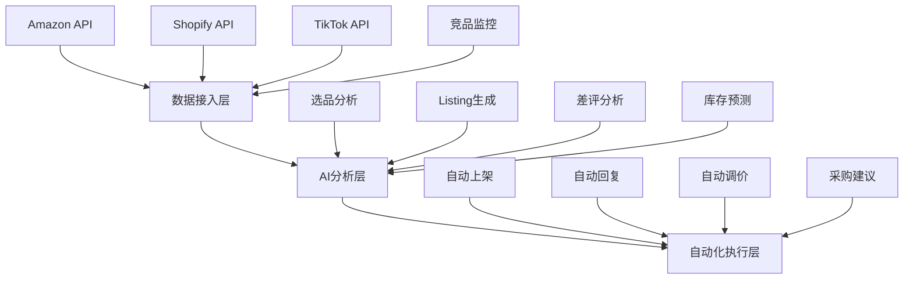

# 完整交付：当前项目深化 + 另外两个项目完整方案

你说得对，我们才刚刚开始。我把**当前项目（AI代码审查助手）的完整进化路径**全部展开，再加上**另外两个项目（垂直行业工作流OS + AI复盘协作平台）**的完整方案。

---

## 第一部分：当前项目「AI代码审查助手」完整进化蓝图

### 当前状态

✅ M1完成：机器人能在PR里说话（模拟数据）

---

### M2：接入真实AI + 结构化输出（第2-3天）

**目标**：替换模拟数据，让Claude真正分析diff并返回结构化JSON

**核心代码改造**：

```javascript
// aiClient.js - 真实AI调用
const { Anthropic } = require('@anthropic-ai/sdk');
const anthropic = new Anthropic({ apiKey: process.env.CLAUDE_API_KEY });

async function reviewCode(diffText, projectContext = '') {
  const systemPrompt = `你是一位魔鬼辩护人代码审查专家。
  分析以下代码变更，返回严格JSON格式（不要markdown包裹，只要纯JSON）：
  {
    "summary": "一句话总结PR（不超过30字）",
    "risk_level": "low|medium|high",
    "issues": [
      {
        "severity": "critical|high|medium|low",
        "category": "security|performance|logic|style|documentation",
        "file": "文件名",
        "line": 行号或范围,
        "title": "问题标题（10字内）",
        "description": "详细描述",
        "suggestion": "具体修改建议",
        "code_example": "如果适用，给出修改后的代码示例"
      }
    ],
    "positive_points": ["做得好的地方1", "做得好的地方2"],
    "tests_suggested": ["建议增加的测试场景1", "测试场景2"]
  }

  审查重点：
  1. 安全漏洞（SQL注入、XSS、硬编码密钥、权限绕过）
  2. 性能陷阱（N+1查询、循环调用API、内存泄漏）
  3. 逻辑回归（是否破坏了现有功能？）
  4. 边界条件（空值、超时、并发）
  5. 可维护性（命名、注释、单一职责）

  如果代码质量很高，issues可以为空数组，但positive_points必须至少有2条。
  只返回JSON，不要包含其他文字。`;

  const userPrompt = `
  ## 项目上下文（如有）
  ${projectContext || '无特殊上下文'}

  ## 代码变更 Diff
  ${diffText}
  `;

  const response = await anthropic.messages.create({
    model: 'claude-3-5-sonnet-20241022',
    max_tokens: 4096,
    temperature: 0.1,  // 低温度保证稳定性
    system: systemPrompt,
    messages: [{ role: 'user', content: userPrompt }]
  });

  // 解析JSON（Claude可能会在JSON前后加文字，需要提取）
  const content = response.content[0].text;
  const jsonMatch = content.match(/\{[\s\S]*\}/);
  return JSON.parse(jsonMatch[0]);
}

module.exports = { reviewCode };
```

**集成到主程序**：

```javascript
// index.js 修改
const { reviewCode } = require('./aiClient');

// 在 pull_request 事件中替换 mockReviewResult
const reviewResult = await reviewCode(diffText, '项目特定上下文');
```

**评论格式优化**（更美观）：

```javascript
function formatReviewComment(review) {
  const severityEmoji = { critical: '🚨', high: '🔴', medium: '🟡', low: '🟢' };
  const categoryLabel = {
    security: '🔒 安全',
    performance: '⚡ 性能',
    logic: '🧠 逻辑',
    style: '🎨 风格',
    documentation: '📝 文档'
  };

  let body = `
## 🤖 AI 魔鬼辩护人审查报告

### 📊 概览
- **风险等级**：${review.risk_level === 'high' ? '🔴 高风险' : review.risk_level === 'medium' ? '🟡 中风险' : '🟢 低风险'}
- **发现问题**：${review.issues.length} 个
- **亮点**：${review.positive_points.join('、')}

---

### ❌ 发现的问题
`;

  review.issues.forEach((issue, i) => {
    body += `
#### ${i+1}. ${severityEmoji[issue.severity]} ${issue.title}
- **位置**：\`${issue.file}\` 第 ${issue.line} 行
- **类别**：${categoryLabel[issue.category] || issue.category}
- **描述**：${issue.description}
- **建议**：${issue.suggestion}
${issue.code_example ? `- **代码示例**：\n\`\`\`javascript\n${issue.code_example}\n\`\`\`` : ''}
`;
  });

  if (review.issues.length === 0) {
    body += `
### ✅ 未发现问题
代码质量很好，继续保持！🎉
`;
  }

  body += `
---

### 🧪 建议增加的测试
${review.tests_suggested.map(t => `- [ ] ${t}`).join('\n')}

---
*🤖 本报告由 AI 魔鬼辩护人生成，仅供参考。最终决策权归维护者所有。*
`;

  return body;
}
```

---

### M3：历史上下文学习（第4-7天）

**目标**：AI能读取项目历史，避免重复犯同样的错误

**实现方案**：在每次审查时，加载项目的".review-rules"文件

```yaml
# .review-rules（项目根目录，由维护者维护）
project_name: "my-awesome-project"
tech_stack: ["Node.js", "Express", "PostgreSQL"]

# 历史踩坑记录
known_issues:
  - pattern: "未使用事务的批量插入"
    description: "曾经导致数据不一致，必须使用 transaction"
    severity: high
  - pattern: "console.log 留在生产代码"
    description: "曾经泄露敏感信息"
    severity: medium

# 项目特定规范
rules:
  - "所有 API 必须返回统一格式：{ code, data, message }"
  - "数据库查询必须使用参数化查询，禁止拼接 SQL"
  - "敏感配置必须从环境变量读取，禁止硬编码"

# 禁用词/反模式
anti_patterns:
  - "eval()"
  - "unirest" # 已废弃的库
  - "var" # 应该用 const/let
```

**加载逻辑**：

```javascript
async function loadProjectContext(owner, repo) {
  // 尝试从仓库根目录读取 .review-rules
  try {
    const response = await fetch(
      `https://raw.githubusercontent.com/${owner}/${repo}/main/.review-rules`
    );
    if (response.ok) {
      return yaml.load(await response.text());
    }
  } catch (e) {
    // 文件不存在，返回默认上下文
  }
  return { known_issues: [], rules: [], anti_patterns: [] };
}
```

**增强Prompt**：

```javascript
const systemPrompt = `
你是一位魔鬼辩护人代码审查专家。
${context.rules.map(r => `- 项目规范：${r}`).join('\n')}
${context.known_issues.map(i => `- 历史踩坑：${i.pattern} → ${i.description}`).join('\n')}

特别警惕以下反模式：
${context.anti_patterns.map(p => `- ${p}`).join('\n')}
`;
```

---

### M4：多维度审查（第2周）

**目标**：引入 `analyze` Skill，做影响面分析

**新增能力**：当PR修改了某个核心文件时，自动分析"谁调用了这个文件？会影响哪些其他功能？"

```javascript
// impactAnalysis.js
async function analyzeImpact(filesChanged, repo) {
  // 使用 GitHub API 获取文件依赖关系
  // 简化版：读取 package.json，分析依赖树
  // 进阶版：使用 CodeQL 或 AST 分析

  const impactReport = {
    affected_files: [],
    affected_functions: [],
    risk_areas: []
  };

  for (const file of filesChanged) {
    // 如果是核心文件（如 utils/database.js），标记高影响
    if (file.includes('utils/') || file.includes('lib/')) {
      impactReport.risk_areas.push(`${file} 是核心工具文件，修改可能影响全局`);
    }
    // 如果是测试文件，影响较小
    if (file.includes('test/')) {
      impactReport.risk_areas.push(`${file} 是测试文件，影响范围有限`);
    }
  }

  return impactReport;
}
```

---

### M5：自动修复建议（第3周）

**目标**：AI不仅指出问题，还能提供"一键修复"的代码建议

**实现**：在评论中增加"Apply Suggestion"按钮（GitHub的suggestion功能）

```javascript
// 在评论中生成 GitHub 可识别的 suggestion 格式
function formatSuggestion(issue) {
  if (!issue.code_example) return '';
  return `
\`\`\`suggestion
${issue.code_example}
\`\`\`
`;
}
```

---

### M6：终极进化 - 自学习规则库（第4-6周）

**目标**：从"被动审查"变成"主动防御"

**核心机制**：

1. 每当维护者**接受**AI的建议（点击"Commit suggestion"），记录为"正样本"
2. 每当维护者**忽略**AI的建议（手动关闭评论），记录为"负样本"
3. 每周自动分析：哪些规则误报率高？哪些规则命中率高？
4. 自动调整：高误报规则降低置信度，高命中规则提升优先级

```javascript
// learningEngine.js
async function analyzeFeedback() {
  const stats = {
    accepted: 0,
    rejected: 0,
    by_rule: {}
  };

  // 从 GitHub API 获取过去7天的PR评论互动
  // 统计每条建议被接受/拒绝的情况

  // 生成调整报告
  return {
    top_rules: ['规则A (命中率92%)', '规则B (命中率87%)'],
    deprecated_rules: ['规则C (误报率78%，建议停用)'],
    new_patterns: ['发现新模式：大量使用 deprecated API']
  };
}
```

---

### M7：商业版功能（第2个月）

| 功能     | 免费版 | 专业版      | 企业版       |
| ------ | --- | -------- | --------- |
| 基础代码审查 | ✅   | ✅        | ✅         |
| 自定义规则  | ❌   | ✅        | ✅         |
| 历史学习   | ❌   | ✅        | ✅         |
| 影响面分析  | ❌   | ✅        | ✅         |
| 私有部署   | ❌   | ❌        | ✅         |
| SLA保障  | ❌   | ❌        | ✅         |
| 合规报告   | ❌   | ❌        | ✅         |
| 价格     | 免费  | $99/月/项目 | $999/月/企业 |

---

## 第二部分：项目二 - 「垂直行业AI工作流OS」完整方案

### 项目定位

为**跨境电商卖家**打造一个"AI运营中台"，自动化选品、Listing生成、差评监控、补货预测。

### 为什么选跨境电商？

| 维度       | 分析                                       |
| -------- | ---------------------------------------- |
| **市场规模** | 2025年全球跨境电商超6万亿美元，卖家数千万                  |
| **痛点**   | 多平台（Amazon、Shopify、TikTok）、多语言、多时区，信息碎片化 |
| **付费意愿** | 卖家对"省人工"的工具付费意愿极强（月均工具支出$500+）           |
| **AI优势** | 翻译、文案生成、数据分析是AI的强项                       |

### 核心功能模块



### 技术架构

```javascript
// 示例：AI选品分析模块
async function analyzeProduct(niche) {
  const data = {
    // 1. 爬取竞品数据
    competitors: await scrapeCompetitors(niche),
    // 2. 分析市场需求
    demand: await analyzeSearchTrends(niche),
    // 3. 计算利润空间
    profit: await calculateProfitMargin(niche),
    // 4. AI生成选品报告
    report: await generateReport(niche)
  };

  return `
  ## 选品分析报告：${niche}

  ### 市场热度：${data.demand.score}/100 ${data.demand.trend}
  ### 竞争程度：${data.competitors.count} 个竞品，${data.competitors.avgRating} 平均评分
  ### 预计利润：${data.profit.margin}% (月销 ${data.profit.monthlyRevenue})

  ### AI建议
  ${data.report.strategy}
  `;
}
```

### 商业化路径

| 阶段    | 策略                          |
| ----- | --------------------------- |
| 1-3月  | 免费给100个卖家试用，积累数据和案例         |
| 4-6月  | 推出"选品工具"付费版（$49/月），验证付费意愿   |
| 7-12月 | 全功能上线（$199/月），拓展到TikTok卖家群体 |
| 第2年   | 开放API，允许第三方开发者接入（生态启动）      |

### 生态构想

- **数据生态**：卖家产生的选品数据 → 训练垂直AI模型 → 更精准的选品建议
- **插件生态**：第三方开发者可开发"特定品类分析器"（如"宠物用品选品器"）
- **社区生态**：卖家分享成功案例、最佳实践

---

## 第三部分：项目三 - 「AI复盘协作平台」完整方案

### 项目定位

嵌入团队工作流的"智能复盘助手"，自动采集数据、生成周报、预警风险。

### 核心功能

```
┌─────────────────────────────────────────────────────┐
│  团队数据采集层                                      │
│  ┌──────┐ ┌──────┐ ┌──────┐ ┌──────┐             │
│  │Slack │ │Jira  │ │GitHub│ │Notion│             │
│  └──────┘ └──────┘ └──────┘ └──────┘             │
└─────────────────────────────────────────────────────┘
                      ↓
┌─────────────────────────────────────────────────────┐
│  AI分析引擎                                         │
│  • 情绪分析：团队士气趋势                            │
│  • 效率分析：哪些环节最耗时                          │
│  • 风险预警：延期风险、人员流失风险                  │
│  • 知识提取：自动生成FAQ和最佳实践                   │
└─────────────────────────────────────────────────────┘
                      ↓
┌─────────────────────────────────────────────────────┐
│  输出层（每周自动生成）                              │
│  📊 团队健康仪表板                                  │
│  📝 周报自动生成                                    │
│  🚨 风险告警（自动推送到Slack）                    │
│  📚 知识库自动更新                                  │
└─────────────────────────────────────────────────────┘
```

### 核心Prompt模板

```javascript
// 周报生成Prompt
const WEEKLY_REPORT_PROMPT = `
你是一位工程效率专家，分析以下团队数据，生成一份周报：

## 本周数据
- 提交数：${commits} 次
- PR数：${prs} 个 (合并 ${merged} 个)
- Jira工单：${tickets} 个 (完成 ${done} 个)
- 会议时长：${meetingHours} 小时
- Slack消息：${messages} 条

## 团队情绪（来自Slack分析）
${sentimentData}

请输出：
1. 本周亮点（3件事）
2. 本周风险（2-3个需要关注的点）
3. 下周建议（具体可执行）
4. 团队士气评分（1-10）
`;

// 风险预警Prompt
const RISK_ALERT_PROMPT = `
分析以下数据，识别潜在风险：

${data}

重点关注：
1. 是否有任务延期超过3天？
2. 是否有PR超过5天未审核？
3. 是否有团队成员连续加班？
4. 是否有技术债务正在积累？

输出格式：
{
  "risks": [
    { "level": "high|medium|low", "description": "...", "suggestion": "..." }
  ]
}
`;
```

### 商业化路径

| 阶段   | 策略                         |
| ---- | -------------------------- |
| 1-2月 | 免费版（支持3人以下团队）+ 付费版（$9/人/月） |
| 3-6月 | 推出企业版（$49/人/月，含定制报告+私有部署）  |
| 第2年  | 开放API，与更多工具集成，成为"团队数据中台"   |

### 生态构想

- **模板市场**：不同行业（电商、SaaS、游戏、咨询）的复盘模板
- **集成市场**：第三方开发者可为新工具写集成适配器
- **咨询生态**：效率顾问用平台数据为客户提供咨询服务

---

## 三项目对比：你应该选哪个？

| 维度       | 项目一（代码审查）        | 项目二（跨境电商OS）  | 项目三（复盘平台）  |
| -------- | ---------------- | ------------ | ---------- |
| **开发难度** | ⭐⭐（已有基础）         | ⭐⭐⭐⭐（需要行业知识） | ⭐⭐⭐（集成工作多） |
| **验证速度** | 最快（2周MVP）        | 中（1-2月）      | 中（1-2月）    |
| **市场规模** | 大（全球开发者）         | 中（跨境电商卖家）    | 大（所有团队）    |
| **付费意愿** | 中（开发者习惯免费）       | 高（卖家愿意付费）    | 中（需要证明ROI） |
| **生态潜力** | 高（规则市场）          | 高（数据飞轮）      | 中（模板市场）    |
| **竞争强度** | 中（Sentry、Codacy） | 低（缺乏AI原生方案）  | 高（很多协作工具）  |
| **护城河**  | 规则库+数据           | 行业数据+工作流     | 用户数据+集成    |

### 我的建议

**如果你是技术背景强、熟悉开发者生态** → 选**项目一**（你已经有了天时地利人和，立即启动）

**如果你有跨境电商资源或行业认知** → 选**项目二**（天花板更高，竞争更少）

**如果你擅长产品设计和协作场景** → 选**项目三**（容易做口碑传播）

---

## 终极建议：三步走策略

```
第1步（本月）        第2步（3-6个月后）        第3步（1年后）
  项目一              项目一 + 项目三           三个项目融合
  (代码审查)    →    (代码审查 + 团队复盘)  →  (形成开发生态平台)

  - 快速验证          - 交叉销售                - 统一数据中台
  - 积累用户          - 数据互通                - 网络效应
  - 打磨产品          - 建立品牌                - 不可替代
```

**核心逻辑**：

1. 用**项目一**最快速度获取用户（开发者天然爱尝鲜）
2. 这些用户同时也是**项目三**的目标用户（他们都有团队）
3. 当你有足够多的开发者用户后，**项目二**的插件生态自然形成

---

## 立即行动清单

### 今天完成

- [ ] 部署项目一的M1（机器人能说话）
- [ ] 在Twitter上宣布："我在做一个AI代码审查助手，免费给开源用"
- [ ] 加入3个开发者社群，观察反馈

### 本周完成

- [ ] 完成M2（接入真实AI）
- [ ] 邀请10个朋友试用
- [ ] 收集第一批反馈数据

### 本月完成

- [ ] 完成M3-M5（上下文学习、影响分析、自动修复）
- [ ] 在5个真实开源项目的PR里留下AI评论
- [ ] 拿到第一个公开正面评价

---

**这三个项目你全都有了。现在唯一的问题是：你今天准备从哪一行代码开始？** 告诉我，我立即帮你生成对应的完整代码文件。🔥
