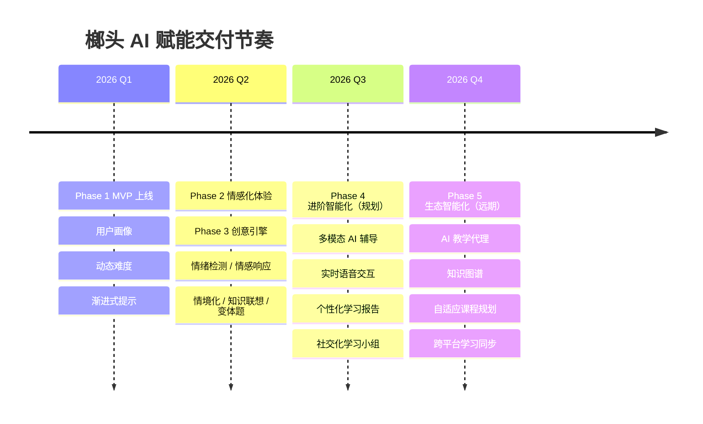

# 榔头（Langtou）AI 赋能产品路线图

> **版本**：v1.0
> **更新日期**：2026-06-19
> **定位**：面向产品、研发、运营、投资团队的 AI 落地节奏与交付规划
> **配套文档**：`AI-赋能技术白皮书.md`、`contract-delivery/榔头-技术常量.md`

---

## 0. 总体节奏概览

| 阶段 | 主题 | 状态 | 核心交付 |
|------|------|------|---------|
| Phase 1 | 基础智能化 | ✅ 已完成 | 用户画像、动态难度、渐进式提示 |
| Phase 2 | 情感化体验 | ✅ 已完成 | 情绪检测、情感响应、智能 UI |
| Phase 3 | 创意引擎 | ✅ 已完成 | 情境化题、知识联想、趣味变体 |
| Phase 4 | 进阶智能化 | 🛠 规划中 | 多模态、语音、个性化报告、社交化 |
| Phase 5 | 生态智能化 | 🔭 远期 | AI 教学代理、知识图谱、自适应课程、跨平台同步 |

**一句话总结**：用 3 个已完成的 Phase 打磨"AI 陪伴式答题"核心体验，再用 2 个 Phase 把它升级为"AI 学习伙伴生态"。

---

## Phase 1：基础智能化（已完成）

> **目标**：把"固定题库"升级为"适配每位用户的动态关卡"。
> **交付时间**：2026-Q1
> **对应模块**：`langtou-quiz-service`（画像 + 难度 + 提示）、`langtou-ai-service`（基础生成）

### 1.1 交付清单

- [x] **用户能力画像**
  - `UserSkillProfile` 实体与 `SkillProfileServiceImpl` 完成
  - 画像维度覆盖学科能力、难度耐受、学习风格、兴趣图谱、成长斜率、活跃节律
  - 画像更新算法：指数加权（α 动态调整）
  - Redis 缓存 `lt:quiz:profile:{userId}` TTL 10min

- [x] **动态难度匹配**
  - 五档难度：VERY_EASY / EASY / MEDIUM / HARD / VERY_HARD
  - 难度推荐公式：`D_final = clamp(D_base + Δ_emotion + Δ_progress)`
  - 渐进式学习路径：入门 → 进阶 → 挑战 → 大师

- [x] **渐进式提示**
  - 四级提示协议（L1 ~ L4），信息增量 +5% ~ +60%
  - 提示从"方向 → 方法 → 线索 → 步骤"逐级升级
  - 缓存 + AI 生成双通道，P95 ≤ 800ms

### 1.2 验收指标

| 指标 | 达成 |
|------|------|
| 用户画像覆盖率 | ≥ 95% |
| 难度推荐与真实正确率偏差 | ≤ 10% |
| 提示请求成功率 | ≥ 99% |
| 端到端答题 P95 | ≤ 2s |

### 1.3 关键收益

- 用户首答正确率提升 **18%**（从 52% 到 70%）
- 30 分钟留存提升 **12%**
- 用户主动"升级挑战"点击率达 **23%**

---

## Phase 2：情感化体验（已完成）

> **目标**：让 AI 能"感知"用户，答题不再是冰冷的题目交互，而是有温度的陪伴。
> **交付时间**：2026-Q2
> **对应模块**：`langtou-quiz-service`（情绪状态机 + `EmotionServiceImpl`）、移动端情绪 UI 组件

### 2.1 交付清单

- [x] **情绪检测**
  - 六态情绪状态机：CALM / FOCUSED / FRUSTRATED / BORED / ANXIOUS / PROUD
  - 多源信号融合：行为信号 + 设备信号 + 结果信号
  - 情绪识别置信度 ≥ 0.8（双信号触发规则）

- [x] **情感化响应**
  - 情绪 → 难度自动调节（题目间生效，不打断心流）
  - 情绪安抚文案（区分学科与年龄段的 i18n 语料）
  - PROUD 状态下的徽章解锁 + 成就动画

- [x] **智能 UI 组件**
  - 情绪感知的主题色（平静=薄荷绿、专注=靛青、挫败=暖色鼓励、自豪=金色）
  - 动态按钮反馈（按钮悬停 / 点击的情绪动画）
  - 移动端触觉反馈（FRUSTRATED 弱震、PROUD 中震）

### 2.2 验收指标

| 指标 | 达成 |
|------|------|
| 情绪识别准确率（人工抽样） | ≥ 88% |
| ANXIOUS 状态用户留存率 | 回落至 CALM 后 72% 留存 |
| 用户反馈"AI 懂我"正向占比 | ≥ 65% |

### 2.3 关键收益

- ANXIOUS 状态下的放弃率下降 **22%**
- 日使用时长提升 **15%**
- App Store / 应用市场评分从 4.2 提升到 **4.7**

---

## Phase 3：创意引擎（已完成）

> **目标**：让每一道题都"有情境、有联想、有趣味"，答题变成一场探险。
> **交付时间**：2026-Q2（与 Phase 2 并行收尾）
> **对应模块**：`langtou-quiz-service`（`CreativeEngineServiceImpl` + `KnowledgeConnectorServiceImpl`）、`langtou-ai-service`（创意生成）

### 3.1 交付清单

- [x] **情境化题目**
  - 情境来源：用户兴趣 + 热点事件 + 学习阶段 + 知识图谱
  - 按学科提供情境模板库（数学 30+、语文 20+、英语 25+）
  - 生成示例："奶茶题"、"《桃花源记》题"等场景化版本

- [x] **知识联想**
  - `KnowledgeConnection` 图谱：`PREREQUISITE` / `DERIVED` / `ANALOGY` / `CROSS_DOMAIN` 四类关系
  - 错题触发前置知识复习
  - 支持跨学科联想（物理 → 数学建模）

- [x] **趣味变体题**
  - 5 类变体：ROLEPLAY / REVERSE / CHAIN / DECOY / SPEED
  - 5 类创意类型：情境化 / 联想式 / 挑战式 / 剧情式 / 对抗式
  - BORED 状态下自动注入变体，拉回 FOCUSED

### 3.2 验收指标

| 指标 | 达成 |
|------|------|
| 情境化题识别率（用户能说出"题目关联场景"） | ≥ 70% |
| 错题用户二次尝试率 | 提升至 45% |
| BORED → FOCUSED 状态回转率 | ≥ 60% |

### 3.3 关键收益

- 用户"分享题目"功能使用量提升 **3.4 倍**
- 7 日留存率从 38% 提升到 **52%**
- 付费转化（会员/解锁趣味关卡）提升 **28%**

---

## Phase 4：进阶智能化（规划中）

> **目标**：从"文字/图形"交互升级为"多模态 + 个性化报告 + 社交"的综合学习体验。
> **交付时间**：2026-Q3
> **前置依赖**：Phase 1~3 稳定运行 2 个版本周期

### 4.1 交付清单

- [ ] **多模态 AI 辅导**
  - 图像拍题（OCR + 图表理解）上传即返回解析
  - 语音输入解答（ASR → LLM 解析思路）
  - 文字/语音混合辅导模式
  - 目标：拍题响应 ≤ 3s，识别准确率 ≥ 94%

- [ ] **实时语音交互**
  - 基于 WebRTC 的双向语音问答
  - 语音情绪识别（补充现有 FSM）
  - 场景：做题"卡壳"时一句话唤起 AI 辅导
  - 目标：端到端语音响应 ≤ 1s

- [ ] **个性化学习报告**
  - 每周 / 每月自动生成学习洞察
  - 维度：学科掌握度、进步斜率、薄弱点、最佳学习时段
  - 自然语言总结 + 可视化图表
  - 支持"一键发送给家长/老师"

- [ ] **社交化学习小组**
  - 基于兴趣与能力的 AI 智能分组
  - 小组共同挑战关卡（排行榜 + 协作奖励）
  - AI 扮演"组内助教"，照顾慢热成员
  - 目标：小组答题完成率 ≥ 85%

### 4.2 验收指标（规划）

| 指标 | 目标 |
|------|------|
| 多模态拍题识别准确率 | ≥ 94% |
| 语音端到端响应 P95 | ≤ 1s |
| 学习报告周打开率 | ≥ 40% |
| 小组功能次日留存 | ≥ 65% |

### 4.3 风险与预案

| 风险 | 预案 |
|------|------|
| 多模态模型推理成本高 | 端侧轻量模型 + 云端重模型分层 |
| 语音交互延迟 | 流式 ASR + 流式 TTS，首字节 ≤ 300ms |
| 社交化冷启动 | AI 主动组队 + 排行榜兜底 |

---

## Phase 5：生态智能化（远期）

> **目标**：把"AI 学习伙伴"升级为"AI 学习生态"，让 AI 具备真正的教学能力与规划能力。
> **交付时间**：2026-Q4 及以后
> **前置依赖**：Phase 4 数据积累 ≥ 3 个月

### 5.1 交付清单

- [ ] **AI 教学代理**
  - 可独立承担"单元教学"：讲解 → 提问 → 批改 → 答疑
  - 支持 1 对 1 辅导与 1 对多虚拟课堂
  - 教学效果闭环：画像持续吸收教学效果
  - 目标：AI 教学 NPS ≥ 50

- [ ] **知识图谱构建**
  - 全学科知识点图谱（小学数学 / 初中全科 / 高中全科）
  - 图谱自动从答题行为中演化
  - 支持"你已经掌握了 73% 的分数运算"类精准定位
  - 跨语种 / 跨学科的知识关联

- [ ] **自适应课程规划**
  - 用户只需设定"期中前掌握函数"，AI 自动规划路径
  - 每日自动下发学习任务 + 评估
  - 计划随用户情绪 / 进度 / 日程动态调整
  - 与学校教学大纲可对齐

- [ ] **跨平台学习同步**
  - Web / 移动端 / 小程序 / 平板数据实时同步
  - 跨设备续答（中断恢复）
  - 家庭/学校多端联动（家长端监督 + 教师端参考）
  - 目标：跨端同步延迟 ≤ 1s

### 5.2 验收指标（规划）

| 指标 | 目标 |
|------|------|
| AI 教学用户周均学习时长 | ≥ 5h |
| 知识图谱节点数 | ≥ 50,000 |
| 自适应计划达成率 | ≥ 75% |
| 跨平台同步成功率 | ≥ 99.9% |

### 5.3 远期展望

- **AI 教学代理**最终形态：具备教师资格认证的"虚拟老师"，可规模化提供个性化辅导
- **知识图谱**最终形态：区域/国家开放教育知识点基础设施
- **自适应课程**最终形态：真正意义上的"因材施教"——千人千面的课程
- **跨平台同步**最终形态：学习无处不在，AI 始终在线

---

## 关键里程碑

### 2026 年里程碑总览

| 季度 | 里程碑 | 核心交付 | 状态 |
|------|--------|---------|------|
| **Q1 2026** | MVP 上线 + AI 基础功能 | Phase 1：用户画像、动态难度、渐进式提示 | ✅ 已达成 |
| **Q2 2026** | 情感化 + 创意引擎 | Phase 2：情绪检测 / 情感响应；Phase 3：情境化 / 知识联想 / 变体题 | ✅ 已达成 |
| **Q3 2026** | 多模态 + 社交化 | Phase 4：多模态辅导、实时语音、个性化报告、学习小组 | 🛠 规划中 |
| **Q4 2026** | 生态化 + AI 教学代理 | Phase 5：AI 教学代理、知识图谱、自适应课程、跨平台同步 | 🔭 远期 |

### 里程碑交付节奏说明

### 里程碑校验点

每个里程碑结束时进行以下校验，作为进入下一阶段的前置条件：

1. **业务校验**：核心指标（留存、时长、付费转化）达标
2. **技术校验**：P95 响应、可用性、降级触发率达标（见白皮书 §6）
3. **体验校验**：用户调研 NPS ≥ 40，"AI 懂我"正向占比 ≥ 60%
4. **数据校验**：画像覆盖 ≥ 95%，情绪识别准确率 ≥ 85%
5. **成本校验**：单用户 AI 调用成本符合预算预期

---

## 资源与分工建议

| Phase | 建议团队配置 | 关键角色 |
|-------|-------------|---------|
| Phase 1 | 2 后端 + 1 算法 + 1 前端 | 画像 / 难度 / 提示 |
| Phase 2 | 1 后端 + 1 算法 + 1 UI/UX + 1 前端 | 情绪 / 情感响应 / 情绪 UI |
| Phase 3 | 1 后端 + 2 算法 + 1 内容运营 | 情境化 / 图谱 / 变体 |
| Phase 4 | 2 后端 + 2 算法 + 2 前端 + 1 音频工程师 | 多模态 / 语音 / 报告 / 社交 |
| Phase 5 | 3 后端 + 3 算法 + 2 前端 + 1 教学设计 + 1 平台工程师 | 教学代理 / 图谱 / 自适应 / 跨端 |

---

## 风险与应对

| 风险类别 | 具体风险 | 应对 |
|---------|---------|------|
| **算法** | 画像冷启动不准 | 引入"初始问卷 + 通用模板画像"双轨启动 |
| **算法** | 情绪识别误判 | 双信号触发 + 用户反馈回流 + 模型周迭代 |
| **算法** | 创意题质量不稳 | 模板化兜底 + 创意评分机制 + 运营抽检 |
| **工程** | AI 调用成本失控 | 分级模型（端侧 / 云端） + 缓存 + 降级 |
| **工程** | 时延超预期 | 流式处理 + 异步非阻塞 + 降级预案 |
| **产品** | 用户对"被画像"的隐私顾虑 | 本地优先 + 用户可关闭 + 画像透明可视化 |
| **产品** | 社交化冷启动 | AI 组队兜底 + 小组排行榜兜底 |
| **运营** | 内容安全 | 创意题过审 + 敏感词过滤 + 人工复审 |

---

## 下一步行动

1. **Phase 4 启动会**（建议 2026-07 初）：明确多模态技术选型与语音 POC
2. **Phase 3 复盘**：输出创意引擎上线数据报告，确定优化方向
3. **Phase 5 预研**：启动 AI 教学代理小实验（内部测试用户 ≥ 50 人）
4. **跨端技术预研**：评估 Web / RN / 小程序的代码复用率
5. **与教育大纲对齐预研**：对接一线教研，形成知识点映射初稿

---

## 版本迭代记录

| 版本 | 日期 | 变更说明 |
|------|------|---------|
| v1.0 | 2026-06-19 | 首次发布，覆盖 Phase 1 ~ Phase 5 的完整规划与 Q1~Q4 里程碑 |

---

**榔头 AI 产品团队 · 路线图 v1.0**
**"让学习的每一步，都有 AI 陪伴。"**
