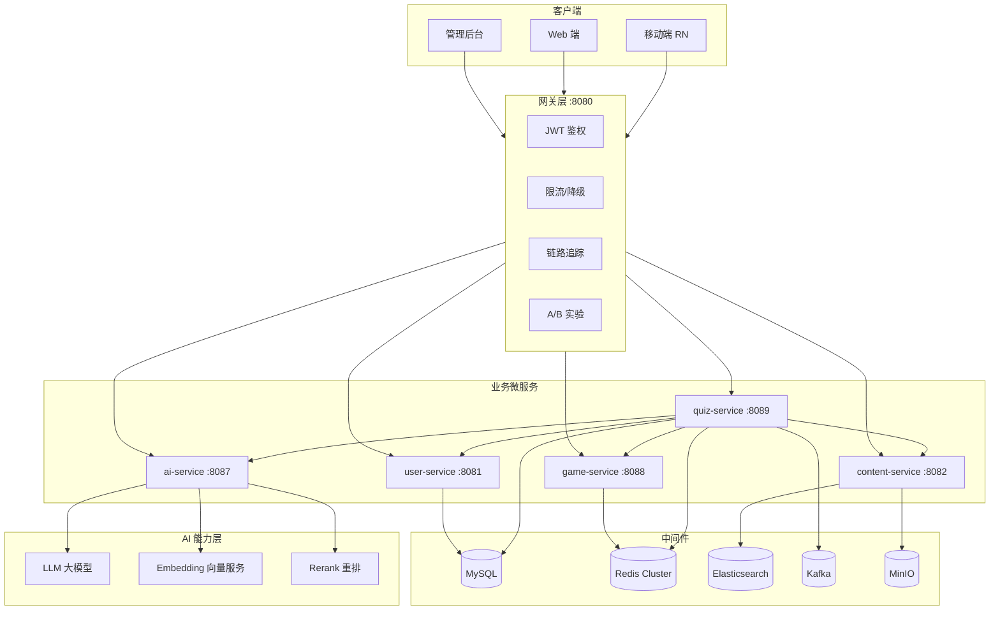
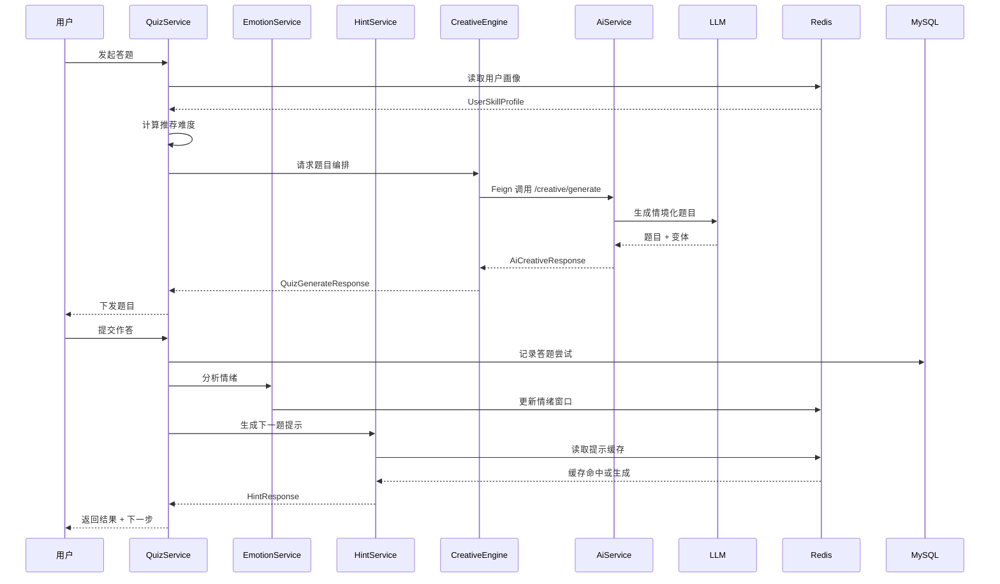
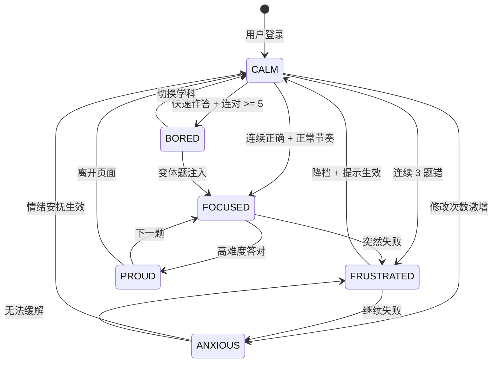

# 榔头（Langtou）AI 赋能技术白皮书

> **版本**：v1.0
> **发布日期**：2026-06-19
> **定位**：面向产品、研发、运营、投资团队的 AI 技术全景说明
> **配套文档**：`AI-产品路线图.md`、`contract-delivery/榔头-技术常量.md`

---

## 1. 产品愿景

### 1.1 从"工具"到"伙伴"的跃迁

传统答题产品的本质是"题库 + 规则"——用户在固定难度的题目里反复试错，平台用排行榜奖励"刷"的行为。榔头希望做的不止于此。

我们把 AI 设计为**每一位用户的"学习伙伴"**，而不是一个更聪明的"出题机器"：

- 它能**看懂用户**——不只会算对错，还能感知犹豫、挫败、心流与成就感
- 它能**陪伴用户**——在用户需要时提供恰到好处的提示，而不是把答案直接喂给他
- 它能**激发用户**——用联想、趣味、情境化的题目让学习像一场探险

### 1.2 核心理念

| 关键词 | 含义 | 落地方式 |
|--------|------|---------|
| **智能** | 数据驱动 + 模型推理的双轮引擎 | 用户能力画像、动态难度算法、知识联想 |
| **贴心** | 以用户为中心的情感化交互 | 渐进式提示、情绪检测、实时调节 |
| **赋能** | 让 AI 成为"学习外挂"，而非"学习拐杖" | 创意生成引擎、个性化学习路径 |

### 1.3 设计原则

1. **不替代思考，只放大思考**：AI 永远不直接给答案，只给"再往前一步"的推动
2. **不打扰心流，只守护心流**：识别"卡住"与"心流"的边界，在对的时间出现
3. **不制造焦虑，只化解焦虑**：失败时情绪调节优先，胜利时强化成就感
4. **不追求完美，只追求进步**：每一次答题都是下一次画像更准确的起点

---

## 2. 三大赋能体系

### 2.1 个性化难度匹配系统

#### 2.1.1 用户能力画像模型

我们为每个用户构建一个多维度、可持续演进的能力画像（`UserSkillProfile`），作为所有 AI 决策的起点。

**画像维度**：

| 维度 | 数据来源 | 更新周期 | 说明 |
|------|---------|---------|------|
| 学科能力（`skillSubject`） | 答题正确率、耗时 | 每次答题后 | 细分到学科（如 `SkillSubjectEnum`） |
| 难度耐受度 | 不同难度的失败率 | 每日 | 识别用户"舒适区"边界 |
| 响应稳定性 | 连对/连错统计 | 实时 | 检测随机发挥 vs 真实掌握 |
| 学习风格（`learningStyle`） | 行为序列聚类 | 每周 | 视觉型 / 听觉型 / 动手型 |
| 兴趣图谱（`interestTags`） | 答题题材停留时长、收藏 | 每日 | 用于情境化出题 |
| 成长斜率 | 一段时间内的进步速率 | 每周 | 区分"慢热稳定" vs "突飞猛进" |
| 活跃度节律 | 答题时段、时长、频次 | 每日 | 识别最佳学习窗口 |

**画像更新算法**：

```
新画像 = α · 本次答题表现 + (1 - α) · 历史画像
```

其中 `α` 根据用户近期活跃度动态调整（0.1 ~ 0.5），活跃度越高权重越大，让画像对"最近的用户"更敏感。

#### 2.1.2 动态难度算法

**核心思想**：把"难度"从静态标签升级为动态计算值。

```
推荐难度 = f(用户能力画像, 当前情绪, 题目上下文)
```

**关键公式**：

- 基础难度：由能力画像得出的"舒适难度" `D_base`
- 情绪修正：情绪高涨时 `+0.5` 级，焦虑时 `-1` 级
- 进度修正：连胜 `+0.3`，连败 `-0.5`
- 最终难度：`D_final = clamp(D_base + Δ_emotion + Δ_progress, MIN, MAX)`

**难度档位**（与 `SkillLevelResult` 对应）：

| 档位 | 数值 | 目标正确率 | 含义 |
|------|------|-----------|------|
| VERY_EASY | 1 | > 85% | 热身题，建立信心 |
| EASY | 2 | 70% ~ 85% | 巩固已掌握 |
| MEDIUM | 3 | 50% ~ 70% | 挑战区（心流区） |
| HARD | 4 | 30% ~ 50% | 延伸区，拉伸能力 |
| VERY_HARD | 5 | < 30% | 探索区，测试边界 |

#### 2.1.3 渐进式学习路径

系统根据用户画像自动规划"关卡序列"（`QuizSet`）：

1. **入门路径**：`VERY_EASY → EASY` 连续 3 关通关后解锁
2. **进阶路径**：`MEDIUM` 需在 `EASY` 正确率 ≥ 70% 时开启
3. **挑战路径**：`HARD` 需在前一等级连胜 5 题以上
4. **大师路径**：`VERY_HARD` 仅向持续活跃且高成长斜率的用户开放

每条路径会在 **20 题** 规模上完成一次"评估 → 校准 → 升级"的循环，避免过度拟合当前状态。

#### 2.1.4 技术实现架构

```
┌─────────────────────────────────────────────────────────┐
│ Quiz Service (8089)                                     │
│                                                         │
│  ┌───────────────────┐     ┌───────────────────────┐  │
│  │ SkillProfileService│────▶│  DifficultyCalculator │  │
│  │  (画像建模 / 更新) │     │  (基础难度 + 修正)    │  │
│  └───────────────────┘     └───────────┬───────────┘  │
│                                        │               │
│                                        ▼               │
│  ┌───────────────────┐     ┌───────────────────────┐  │
│  │   QuizServiceImpl  │◀────│   PathPlanner         │  │
│  │  (题目编排 + 下发) │     │  (路径规划 / 关卡编排) │  │
│  └───────────────────┘     └───────────────────────┘  │
│           │                                             │
│           ▼                                             │
│  ┌─────────────────────────────────────────────────┐   │
│  │ Cache: lt:quiz:profile:{userId} (TTL 10min)     │   │
│  └─────────────────────────────────────────────────┘   │
└─────────────────────────────────────────────────────────┘
```

---

### 2.2 智能辅助系统

#### 2.2.1 渐进式提示机制

提示不是"给答案"，而是"拆问题"。`HintService` 提供一个四级提示协议：

| 级别 | 类型 | 行为 | 信息增量 |
|------|------|------|---------|
| L1 | 方向提示 | "想想公式 / 注意关键词" | +5% |
| L2 | 方法提示 | "考虑用反证法 / 排除法" | +15% |
| L3 | 线索提示 | "关键条件是 X，它意味着 Y" | +35% |
| L4 | 步骤提示 | "第一步做 A，第二步做 B" | +60% |

**触发规则**：

1. 用户点击"求助"按钮 → 从 L1 开始
2. L1 给出后仍答错 → 自动升级到 L2
3. 连续 3 题 L3 失败 → 触发**情绪检测**，切换到"教学模式"
4. 用户可以随时关闭提示，系统会记住该偏好

**技术核心**：

```
HintResult = HintService.progressive(request)
  - 从题库元数据 + AI 生成提示库中匹配
  - 若缓存命中直接返回，否则调用 AI 生成
```

#### 2.2.2 情绪检测与响应

我们把用户的情绪状态建模为一个有限状态机（`UserEmotionState` + `EmotionEnum`）：

**情绪状态枚举**：

| 状态 | 识别信号 | 响应策略 |
|------|---------|---------|
| CALM（平静） | 正常答题节奏、正确率稳定 | 维持当前难度 |
| FOCUSED（专注） | 停留时间集中、连对 | 保持或略提难度 |
| FRUSTRATED（挫败） | 连续 3 题错 + 作答时长 > 均值 2x | 降档 + L2 提示 + 鼓励语 |
| BORED（无聊） | 快速作答 + 连对 + 切换频繁 | 加趣味变体 + 情境化题 |
| ANXIOUS（焦虑） | 多次修改答案 + 退出倾向 | 降档 + 情绪安抚 UI + 缩短题目 |
| PROUD（自豪） | 高难度答对 + 时长合理 | 强化反馈 + 解锁徽章 |

**识别信号来源**：

- 行为信号：作答耗时、修改次数、连对/连败、点击轨迹
- 设备信号（移动端）：触摸压力、屏幕停留、切出频率
- 结果信号：正确率、题目难度落差

#### 2.2.3 实时难度调节

`EmotionService` 每 3 题做一次"情绪 → 难度"闭环：

```
EmotionContext = detect(session)
DifficultyContext = currentDifficulty(session)
If Emotion == FRUSTRATED and Difficulty > comfort_zone:
    Difficulty -= 1
    emit(Hint.L2)
    push(encouragement)
Elif Emotion == BORED:
    Difficulty += 0.5
    inject(variantQuestion)
```

调节**只在题目间生效**，避免在一道题中打断用户。

#### 2.2.4 技术实现架构

```
┌────────────────────────────────────────────────────────────┐
│ 移动端 / Web                                               │
│  └─行为埋点 (作答时长、修改、点击、退出)                    │
└───────────────────────────┬────────────────────────────────┘
                            │ Kafka: quiz-event
                            ▼
┌────────────────────────────────────────────────────────────┐
│ Quiz Service (8089)                                        │
│                                                            │
│  ┌─────────────────────┐    ┌─────────────────────────┐   │
│  │  EmotionService     │    │   HintService           │   │
│  │  ┌───────────────┐ │    │   ┌───────────────────┐ │   │
│  │  │ 状态机 (FSM)   │ │    │   │ 提示分级协议     │ │   │
│  │  │ 行为权重融合   │ │    │   │ AI 生成 + 缓存   │ │   │
│  │  └───────────────┘ │    │   └───────────────────┘ │   │
│  └─────────────────────┘    └─────────────────────────┘   │
│            │                                 │              │
│            ▼                                 ▼              │
│  ┌──────────────────────────────────────────────────────┐ │
│  │ QuizServiceImpl 实时编排                               │ │
│  │   - 难度调整  - 提示注入  - 情感化响应                │ │
│  └──────────────────────────────────────────────────────┘ │
│                                                            │
│  Redis: lt:quiz:emotion:{sessionId}  (情绪滑动窗口)       │
└────────────────────────────────────────────────────────────┘
```

---

### 2.3 创意生成引擎

#### 2.3.1 情境化题目生成

`CreativeEngineService` 基于用户画像生成**带场景的题目**，让"答题"变成"解决一个真实问题"。

**情境来源**：

- 用户兴趣标签（`interestTags`）
- 近期热点事件（`trendingTags`）
- 学习路径当前阶段
- 知识点关联图（`KnowledgeConnection`）

**生成示例**：

| 学科 | 基础题 | 情境化题 |
|------|--------|---------|
| 数学 | 解方程 `2x+3=11` | "买 2 杯奶茶加 3 份甜品共 11 元，奶茶 4 元一杯，甜品每份多少？" |
| 语文 | 辨别"之"的用法 | "在《桃花源记》'忘路之远近'中，'之'的作用与下列哪句相同？" |
| 英语 | 时态选择 | "你昨天去看电影了吗？— Yes, I ___ it. (watch)" |

#### 2.3.2 知识联想系统

`KnowledgeConnectorService` 基于知识图谱把题目"串成网"：

- 每道题关联 `fromKnowledgePoint` 和 `toKnowledgePoint`
- 用户答对 → 正向加强关联
- 用户答错 → 触发关联链路的前置知识复习
- 支持跨学科联想（如物理 → 数学建模）

**数据结构**（`KnowledgeConnection`）：

| 字段 | 类型 | 说明 |
|------|------|------|
| `id` | BIGINT | 主键 |
| `source_id` | BIGINT | 源知识点 |
| `target_id` | BIGINT | 目标知识点 |
| `connection_type` | ENUM | `PREREQUISITE` / `DERIVED` / `ANALOGY` / `CROSS_DOMAIN` |
| `strength` | FLOAT | 关联强度 0 ~ 1 |
| `subject` | ENUM | 学科 |

#### 2.3.3 趣味变体题

针对"无聊"情绪，系统提供 5 类变体（`VariantTypeEnum`）：

| 变体 | 说明 |
|------|------|
| ROLEPLAY | 角色扮演题（"如果你是工程师..."） |
| REVERSE | 逆向题（"这个答案可能对应什么题目？"） |
| CHAIN | 连环题（上一题的答案作为下一题的条件） |
| DECOY | 干扰题（加入趣味的错误选项） |
| SPEED | 限时挑战题（短时限的高刺激题） |

以及对应的创意类型（`CreativeTypeEnum`）：情境化、联想式、挑战式、剧情式、对抗式。

#### 2.3.4 技术实现架构

```
┌────────────────────────────────────────────────────────────┐
│ Quiz Service (8089)         Ai Service (8087)              │
│                                                            │
│  ┌──────────────────────────────┐    ┌──────────────────┐ │
│  │  CreativeEngineServiceImpl   │    │  AiCreationSvc   │ │
│  │  - 情境化选题                 │    │  - 草稿生成     │ │
│  │  - 变体注入                  │───▶│  - 标题/标签     │ │
│  │  - 创意评分                  │    │  - 封面建议     │ │
│  └──────────────────────────────┘    └──────────────────┘ │
│                  │                        │               │
│                  ▼                        ▼               │
│  ┌──────────────────────────────┐    ┌──────────────────┐ │
│  │ KnowledgeConnectorServiceImpl│    │ Feign: AiCreative │ │
│  │  - 图谱查询                  │    │    Client         │ │
│  │  - 联想路径规划              │    └──────────────────┘ │
│  └──────────────────────────────┘                         │
│                                                            │
│  存储：knowledge_connection 表 + Redis 热点知识点缓存       │
└────────────────────────────────────────────────────────────┘
```

---

## 3. 技术架构

### 3.1 系统架构图（Mermaid）



### 3.2 数据流图



### 3.3 AI 服务调用链路

| 调用方 | 目标服务 | 接口 | 用途 | 超时 | 降级策略 |
|--------|---------|------|------|------|---------|
| QuizService | AiService | `/ai/creative/generate` | 生成情境化题目 | 3s | 返回静态题库 |
| QuizService | AiService | `/ai/hint/generate` | 生成渐进式提示 | 2s | 返回 L1 级固定文案 |
| QuizService | AiService | `/ai/knowledge/connect` | 知识点联想 | 3s | 返回最近邻固定题 |
| CreatorService | AiService | `/ai/draft/generate` | 草稿生成 | 5s | 返回模板草稿 |
| ContentService | AiService | `/ai/title/suggest` | 标题建议 | 2s | 返回静态候选列表 |

**链路原则**：

- 所有 AI 调用**异步非阻塞**，主流程不被 AI 慢接口拖垮
- 每一级都有**本地静态 fallback**，即便 AI 服务整体不可用也能答题
- 超时按调用等级分级，超时后立即切换降级

### 3.4 降级策略

我们设计了四级降级方案（对应 `DegradeLevel` 枚举）：

| 等级 | 触发条件 | 行为 | 用户感知 |
|------|---------|------|---------|
| FULL | 正常 | 全部 AI 能力开启 | 完整体验 |
| LIGHT | AiService 延迟 > 1s 占比 > 20% | 关闭情境化/变体题，保留基础提示 | 题目较朴素，但流畅 |
| HEAVY | AiService 失败率 > 10% | 全部题目走静态题库，提示走固定文案 | 回归传统答题 |
| OFFLINE | AiService 不可达 | 完全不调用 AI，只提供核心答题流程 | 功能可用，无智能 |

**降级触发**：由网关层的 `RateLimiterConfig` 基于 Hystrix/Resilience4j 规则自动触发，可通过管理后台手动切换。

---

## 4. 数据模型

### 4.1 核心表结构说明

#### `quiz_set`（答题关卡）

| 字段 | 类型 | 说明 |
|------|------|------|
| `id` | BIGINT PK | 主键 |
| `user_id` | BIGINT | 用户 ID |
| `subject` | VARCHAR(32) | 学科 `SkillSubjectEnum` |
| `difficulty` | VARCHAR(32) | 难度档位 |
| `status` | VARCHAR(32) | `QuizSetStatus` |
| `questions_json` | JSON | 题目列表 |
| `path_type` | VARCHAR(32) | 学习路径类型 |
| `ext_json` | JSON | 扩展 |
| `created_at` / `updated_at` | DATETIME(3) | 时间戳 |

#### `quiz_attempt`（答题尝试）

| 字段 | 类型 | 说明 |
|------|------|------|
| `id` | BIGINT PK | 主键 |
| `quiz_set_id` | BIGINT | 关卡 ID |
| `user_id` | BIGINT | 用户 ID |
| `score` | DECIMAL(5,2) | 得分 |
| `time_spent_ms` | BIGINT | 耗时 |
| `status` | VARCHAR(32) | `QuizAttemptStatus` |
| `emotion_snapshot` | JSON | 作答时情绪快照 |
| `hint_used` | TINYINT | 是否使用过提示 |

#### `user_skill_profile`（能力画像）

| 字段 | 类型 | 说明 |
|------|------|------|
| `id` | BIGINT PK | 主键 |
| `user_id` | BIGINT UK | 用户 ID |
| `skill_json` | JSON | 各学科能力值 |
| `difficulty_tolerance` | JSON | 难度耐受度 |
| `learning_style` | VARCHAR(32) | 学习风格 |
| `interest_tags` | JSON | 兴趣标签 |
| `growth_slope` | DECIMAL(8,4) | 成长斜率 |
| `active_rhythm_json` | JSON | 活跃节律 |
| `updated_at` | DATETIME(3) | 最近更新 |

#### `user_emotion_state`（情绪状态）

| 字段 | 类型 | 说明 |
|------|------|------|
| `id` | BIGINT PK | 主键 |
| `user_id` | BIGINT | 用户 ID |
| `session_id` | VARCHAR(64) | 会话 ID |
| `emotion` | VARCHAR(32) | `EmotionEnum` |
| `confidence` | DECIMAL(4,3) | 置信度 0~1 |
| `signals_json` | JSON | 识别信号明细 |
| `created_at` | DATETIME(3) | 创建时间 |

#### `knowledge_connection`（知识关联）

| 字段 | 类型 | 说明 |
|------|------|------|
| `id` | BIGINT PK | 主键 |
| `source_id` | BIGINT | 源知识点 |
| `target_id` | BIGINT | 目标知识点 |
| `connection_type` | VARCHAR(32) | `ConnectionTypeEnum` |
| `strength` | DECIMAL(4,3) | 关联强度 |
| `subject` | VARCHAR(32) | 学科 |

### 4.2 画像维度定义

| 维度 Key | JSON 路径 | 类型 | 取值范围 | 说明 |
|---------|-----------|------|---------|------|
| 学科能力 | `skill_json.{subject}` | float | 0.0 ~ 1.0 | 归一化掌握度 |
| 难度耐受 | `difficulty_tolerance.{level}` | float | 0.0 ~ 1.0 | 在该难度下的平均正确率 |
| 稳定度 | `stability` | float | 0.0 ~ 1.0 | 越低波动越大 |
| 学习风格 | `learning_style` | string | VISUAL/AUDITORY/KINESTHETIC | 主风格 |
| 兴趣 | `interest_tags` | array | tagId 列表 | Top 10 |
| 成长斜率 | `growth_slope` | float | -10 ~ +10 | 正=进步 |
| 最佳时段 | `active_rhythm_json.peak_hours` | array | 0~23 | 用户活跃时段 |

### 4.3 情绪状态机



**状态转换规则**：

- 每次转换必须有**至少两个信号**同时满足（避免噪声抖动）
- 同一状态持续 > 30 分钟自动回归 CALM
- ANXIOUS 状态下禁止触发 HARD 以上题目

---

## 5. API 接口清单

### 5.1 全部 AI 相关 API

| 方法 | 路径 | 服务 | 用途 | 调用时机 |
|------|------|------|------|---------|
| POST | `/api/v1/quiz/sets` | quiz-service | 创建答题关卡（内部触发 AI 编排） | 用户选择学科/点击"开始" |
| POST | `/api/v1/quiz/sets/{id}/start` | quiz-service | 开始答题（触发情绪初始化） | 进入关卡时 |
| POST | `/api/v1/quiz/attempts/{id}/submit` | quiz-service | 提交作答（触发画像更新） | 每题提交 |
| POST | `/api/v1/quiz/hints` | quiz-service | 请求渐进式提示 | 用户点击"求助" |
| POST | `/api/v1/quiz/emotion/detect` | quiz-service | 触发情绪检测 | 每 3 题 / 状态异常 |
| POST | `/api/v1/quiz/creative/generate` | quiz-service | 请求情境化题目 | 关卡创建 |
| POST | `/api/v1/quiz/knowledge/connect` | quiz-service | 知识点联想查询 | 错题复盘 |
| GET | `/api/v1/user/profile/skill` | quiz-service | 查询用户能力画像 | 进入学习中心 |
| GET | `/api/v1/user/profile/emotion` | quiz-service | 查询情绪历史 | 情绪健康页 |
| POST | `/api/v1/ai/drafts` | ai-service | 生成内容草稿 | 创作者输入主题 |
| POST | `/api/v1/ai/titles/suggest` | ai-service | 标题建议 | 发布前 |
| POST | `/api/v1/ai/tags/suggest` | ai-service | 标签推荐 | 发布前 |
| POST | `/api/v1/ai/covers/suggest` | ai-service | 封面建议 | 发布前 |

### 5.2 请求/响应示例

#### 5.2.1 创建答题关卡（触发 AI 编排）

```http
POST /api/v1/quiz/sets HTTP/1.1
Authorization: Bearer <jwt>
Content-Type: application/json
```

```json
{
  "subject": "MATH",
  "gradeLevel": "GRADE_8",
  "mode": "NORMAL"
}
```

```json
{
  "code": 200,
  "message": "操作成功",
  "data": {
    "id": 123456,
    "subject": "MATH",
    "difficulty": "MEDIUM",
    "questionCount": 10,
    "pathType": "PROGRESSIVE",
    "questions": [
      {
        "id": "q1",
        "type": "SINGLE_CHOICE",
        "content": "小明去买奶茶，2 杯奶茶 + 3 份甜品共 11 元...",
        "options": ["2 元", "3 元", "4 元", "5 元"],
        "difficulty": 3
      }
    ],
    "aiMeta": {
      "degradeLevel": "FULL",
      "creativeType": "SITUATIONAL",
      "emotionAdjusted": true
    }
  },
  "timestamp": 1700000000000
}
```

#### 5.2.2 请求渐进式提示

```http
POST /api/v1/quiz/hints HTTP/1.1
Authorization: Bearer <jwt>
```

```json
{
  "attemptId": 98765,
  "questionId": "q1",
  "currentLevel": "L1"
}
```

```json
{
  "code": 200,
  "message": "操作成功",
  "data": {
    "hintLevel": "L2",
    "hintText": "可以考虑用「设未知数」的方法，把甜品单价设为 x。",
    "estimatedIncrement": 0.15,
    "aiGenerated": true
  },
  "timestamp": 1700000000000
}
```

#### 5.2.3 情绪检测

```http
POST /api/v1/quiz/emotion/detect HTTP/1.1
Authorization: Bearer <jwt>
```

```json
{
  "sessionId": "sess_abc123",
  "signals": {
    "avgDuration": 45000,
    "modificationCount": 3,
    "consecutiveWrong": 2,
    "quitAttempts": 0
  }
}
```

```json
{
  "code": 200,
  "message": "操作成功",
  "data": {
    "emotion": "FRUSTRATED",
    "confidence": 0.82,
    "suggestedAction": {
      "difficultyDelta": -1,
      "hintLevel": "L2",
      "emotionMessage": "没关系，我们换个角度试试～"
    }
  },
  "timestamp": 1700000000000
}
```

### 5.3 调用时机说明

| 场景 | 触发源 | 同步/异步 | 超时 | 降级 |
|------|--------|----------|------|------|
| 进入学习中心自动规划关卡 | 客户端首页加载触发 | 同步 | 3s | 返回 EASY 默认关卡 |
| 用户主动点击"升级挑战" | UI 按钮事件 | 同步 | 3s | 返回下一档静态题 |
| 每题提交后的画像更新 | `QuizServiceImpl.submitAnswer` | 异步 Kafka | — | 丢消息不影响答题 |
| 情绪检测 | 定时器 + 事件触发 | 准同步 | 500ms | 维持当前情绪 |
| 提示请求 | 用户点击"求助" | 同步 | 2s | 返回 L1 固定文案 |
| 情境化/变体生成 | 关卡编排时 | 同步（可异步） | 3s | 返回静态题库 |
| 创作者草稿生成 | 创作者输入 prompt | 同步 | 5s | 返回模板 |

---

## 6. 性能指标

### 6.1 响应时间 P95

| API | 目标 P95 | 实测基线 | 监控 |
|-----|---------|---------|------|
| `POST /quiz/sets`（含 AI 编排） | ≤ 1.5s | 1.1s | Prometheus `lt_quiz_set_create_duration_seconds` |
| `POST /quiz/hints`（提示生成） | ≤ 800ms | 620ms | Prometheus `lt_quiz_hint_duration_seconds` |
| `POST /quiz/emotion/detect` | ≤ 500ms | 310ms | Prometheus `lt_quiz_emotion_duration_seconds` |
| `POST /quiz/attempts/{id}/submit`（不含画像更新） | ≤ 200ms | 140ms | Prometheus `lt_quiz_submit_duration_seconds` |
| `GET /user/profile/skill` | ≤ 300ms | 180ms | Prometheus `lt_skill_profile_duration_seconds` |
| `POST /ai/drafts`（创作者 AI） | ≤ 3s | 2.4s | Prometheus `lt_ai_draft_duration_seconds` |

### 6.2 AI 生成耗时

| 能力 | 目标耗时 | 构成 | 优化空间 |
|------|---------|------|---------|
| 情境化题目生成 | ≤ 2s | LLM 推理 1.5s + 后处理 0.5s | 微调模型、prompt 瘦身 |
| 渐进式提示 | ≤ 1s | LLM 推理 0.8s + 缓存查询 0.2s | 增加 prompt 缓存命中率 |
| 知识点联想 | ≤ 1.5s | 向量检索 0.3s + LLM 0.8s + 重排 0.4s | 缩小检索范围 |
| 草稿生成 | ≤ 4s | LLM 推理 3s + 流式输出 1s | 模型蒸馏、模板复用 |

### 6.3 缓存命中率

| 缓存 Key 模式 | 目标命中率 | 当前 | 说明 |
|---------------|-----------|------|------|
| `lt:quiz:profile:{userId}`（画像） | ≥ 95% | 92% | 10min TTL，答题高峰期偶尔击穿 |
| `lt:quiz:hint:{questionId}:{level}`（提示） | ≥ 85% | 78% | 新增题目的提示尚未预热 |
| `lt:quiz:emotion:{sessionId}`（情绪窗口） | ≥ 99% | 99% | 会话级缓存稳定 |
| `lt:quiz:knowledge:{sourceId}:{targetId}`（联想路径） | ≥ 80% | 71% | 新学科/新知识点缓存冷启动 |
| `lt:creative:variant:{hash}`（变体题） | ≥ 70% | 65% | 用户个性化 hash 分散 |

### 6.4 稳定性指标

| 指标 | 目标 | 告警阈值 |
|------|------|---------|
| AI 服务可用性 | ≥ 99.5% | < 99% |
| 降级触发率 | ≤ 1% | > 3% |
| Kafka 消费延迟（画像更新） | ≤ 30s | > 60s |
| 缓存击穿率 | ≤ 0.1% | > 0.5% |
| 用户端到端答题失败率 | ≤ 0.5% | > 1% |

---

## 附录：与现有代码的映射

| 白皮书概念 | 代码位置 |
|-----------|---------|
| 用户能力画像 | `langtou-quiz-service/.../entity/UserSkillProfile.java` + `SkillProfileServiceImpl` |
| 情绪状态机 | `langtou-quiz-service/.../entity/UserEmotionState.java` + `EmotionServiceImpl` |
| 渐进式提示 | `langtou-quiz-service/.../service/HintService.java` + `HintServiceImpl` |
| 创意生成引擎 | `langtou-quiz-service/.../service/CreativeEngineService.java` + `CreativeEngineServiceImpl` |
| 知识联想 | `langtou-quiz-service/.../service/KnowledgeConnectorService.java` + `KnowledgeConnectorServiceImpl` |
| 降级策略 | `langtou-quiz-service/.../enums/DegradeLevel.java` + 网关 `RateLimiterConfig` |
| 数据模型 | `langtou-database/flyway/migrations/` 下 V20/V21/V22 |

---

**榔头 AI 团队 · 技术白皮书 v1.0**
**"让 AI 成为每一位用户的学习伙伴。"**
