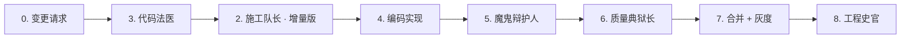

# 契约式交付工作流 · SOP（标准作业程序）

> **版本**：v1.0  
> **生效日期**：2026-06-19  
> **适用范围**：榔头（Langtou）项目所有新功能开发、存量系统改造、MVP 迭代  
> **核心哲学**：**先契约，后实现；先验证，后合并；先文档，后交付**

---

## 一、6 大角色职责定义与触发条件

契约式交付以"角色"为执行单元，每个角色对应一个独立的思维视角与产出物。6 个角色必须按顺序串行激活，上一个角色的产出是下一个角色的输入。

| # | 角色 | 代号 | 核心职责 | 触发条件 | 主要产出物 |
|---|------|------|---------|---------|-----------|
| 1 | 🧭 **产品侦探** | Product-Detective | 在动手写代码前，先把"要解决什么问题"摸清楚，输出不可逾越的需求边界 | 新项目启动 / 现有系统新增独立模块 / 需求变更 ≥ 30% | `requirements-{feature}.md` |
| 2 | 👷 **施工队长** | Construction-Lead | 把需求拆解为可执行的施工路线图，明确依赖、工期、交付节奏 | 产品侦探完成需求清单后立即触发 | `construction-plan-{feature}.md` |
| 3 | 🔬 **代码法医** | Code-Forensics | 对目标模块进行调用链与影响面分析，锁定会被触碰的代码与数据表 | 施工队长完成任务拆解后、动手改代码前 | `impact-analysis-{feature}.md` |
| 4 | 👿 **魔鬼辩护人** | Devil's-Advocate | 假设代码必有问题，从安全/边界/回归/可观测性/性能 5 个维度挑刺 | 代码实现完成、自测通过后，代码评审前 | `review-report-{feature}.md` |
| 5 | ⛓️ **质量典狱长** | Quality-Warden | 为代码套上测试的枷锁，补齐单元测试、集成测试、回归测试，直到质量门禁全绿 | 魔鬼辩护人审查通过后、合并到主干前 | `qa-pass-report.md`（覆盖率 + 通过率 + 修复清单） |
| 6 | 📚 **工程史官** | Engineering-Archivist | 把本次迭代的常量、SOP、踩坑记录、交付标准沉淀为可复用的知识库 | 功能上线后 / 版本发布后 | 技术常量、SOP 更新、迭代复盘 |

### 1.1 角色激活前置依赖

```
产品侦探 ──► 施工队长 ──► 代码法医 ──► 魔鬼辩护人 ──► 质量典狱长 ──► 工程史官
   │             │            │             │            │            │
   ▼             ▼            ▼             ▼            ▼            ▼
 requirements   construction  impact        review       qa-pass     knowledge
   .md            -plan.md    -analysis.md  -report.md    -report.md   （常量 + SOP）
```

> 任一角色未完成，下一角色**不得提前启动**。特殊情况下可并行启动的仅限"代码法医 ↔ 产品侦探补充细节"，但必须在施工队长输出终稿前完成合并。

---

## 二、标准执行流程

### 2.1 场景 A：新项目 / 新模块（MVP 级）


| 步骤 | 角色 / 动作 | 输入 | 输出 | 门禁 |
|------|------------|------|------|------|
| 0 | 立项 | 业务目标、资源评估 | 迭代 Kickoff 文档 | 项目负责人签字 |
| 1 | 产品侦探 | 业务目标 | `requirements-{feature}.md` | 6 维度需求全部有答案 |
| 2 | 施工队长 | 需求文档 | `construction-plan-{feature}.md` | 任务依赖图无环，工期 ≤ 可用工时 120% |
| 3 | 代码法医 | 需求 + 施工计划 | `impact-analysis-{feature}.md` | 高危项全部有缓解方案 |
| 4 | 编码实现 | 施工计划 + 影响分析 | 可运行代码 + 单元测试 | CI 绿 |
| 5 | 魔鬼辩护人 | 代码 + 影响分析 | `review-report-{feature}.md` | 🔴 高危项全清零 |
| 6 | 质量典狱长 | 审查报告 + 代码 | `qa-pass-report.md` | 覆盖率 ≥ 70%，阻塞项全绿 |
| 7 | 评审 / 合并 | QA 报告 | 合并后的主干 | 2 人 Code Review 通过 |
| 8 | 工程史官 | 所有产出 | SOP / 常量 / 复盘 | 知识库更新完成 |
| 9 | 发版交付 | 全链路产出 | 发版说明 + 用户文档 | 运维签字 |

### 2.2 场景 B：老系统修改（存量迭代 / Bug Fix / 架构演进）



**差异点说明**：
- **跳过产品侦探**：已有系统的业务目标已定，仅在"需求变更 ≥ 30%"时补做产品侦探。
- **代码法医前置**：存量系统的首要风险是"你不知道你会影响谁"，因此代码法医必须是第一步。
- **施工队长做增量拆解**：只输出变更部分的子任务，而不是全量路线图。
- **灰度发布**：老系统修改必须附带灰度 / 金丝雀发布方案，由 DevOps 工程师纳入产出物。

### 2.3 场景 C：紧急 Hotfix

1. 代码法医 30 分钟内输出"影响面最小修复路径"
2. 施工队长输出 1~2 个紧急任务
3. 编码 + 魔鬼辩护人 + 质量典狱长**合并为一次过审**
4. 工程史官在修复完成后 24 小时内补齐 SOP 与复盘

---

## 三、产出物清单与交付标准

### 3.1 产出物清单

| 类别 | 文件名 | 存放路径 | 责任人 | 交付标准 |
|------|--------|---------|--------|---------|
| 需求 | `requirements-{feature}.md` | `langtou-team-config/contract-delivery/` | 产品侦探 | 6 维度（核心目标 / 边界 / 禁区 / 验收 / 失败 / 成功）必填，禁止空项 |
| 计划 | `construction-plan-{feature}.md` | 同上 | 施工队长 | 任务粒度 ≤ 半天、依赖关系无环、工期合计 ≤ 可用工时 × 1.2 |
| 分析 | `impact-analysis-{feature}.md` | 同上 | 代码法医 | 调用链覆盖 100% 被修改的类，每个风险标注等级（🔴/🟡/🟢）与缓解方案 |
| 审查 | `review-report-{feature}.md` | 同上 | 魔鬼辩护人 | 5 维度（安全/边界/回归/可观测性/性能）全覆盖，🔴 项必须全部清零方可进入下一角色 |
| 测试 | `qa-pass-report.md` | 同上 | 质量典狱长 | 单测覆盖率 ≥ 70%、核心流程集成测试 100%、P0 缺陷数 = 0 |
| 常量 | `榔头-技术常量.md` | 同上 | 工程史官 | 每次迭代后增量更新，保证新服务/新枚举/新错误码被纳入 |
| SOP | `SOP-契约式交付工作流.md` | 同上 | 工程史官 | 每轮迭代复盘后必要时修订，重大流程变更需版本号升级 |
| 快照 | `PROGRESS-STATUS.md` | `langtou-team-config/` | 工程史官 | 每次角色完成后实时更新，作为下次会话的唯一入口 |

### 3.2 交付物质量门禁（DoD, Definition of Done）

一份产出物只有在满足以下所有条件时才算"完成"：

- [ ] 文件名符合命名规范（小写-kebab 或小写下划线，模块名明确）
- [ ] 包含**版本号**与**最后更新时间**
- [ ] 包含**责任人**与**下一角色接收人**
- [ ] 关键结论使用**表格 / 清单**呈现，不得只写散文
- [ ] 引用的代码位置给出**精确到文件路径 + 行号**的定位
- [ ] 风险条目标注等级（🔴 高危 / 🟡 中危 / 🟢 低危）与**缓解方案**
- [ ] 附带**下一角色的输入清单**，避免交接时信息丢失

---

## 四、常见问题与解决方案（FAQ）

### Q1. 上一个角色的产出不完整，能不能先往下推进？
**不能**。契约式交付的核心是"角色之间以契约交接"。如果上一个角色的产出不完整，下一角色的决策依据必然失真，最终会把错误放大到代码里。**解决方案**：退回上一角色补齐，并记录到本次迭代的复盘。

### Q2. 代码法医分析出的高危项太多，工期要翻倍怎么办？
**两种处理方式**：
1. **拆 MVP**：把高危项对应的功能切到"二期"，本次迭代只做低风险核心闭环。
2. **引入灰度**：保留代码改动，但通过开关（Feature Flag）灰度上线，在质量典狱长阶段加自动化回归脚本。

### Q3. 魔鬼辩护人挑出的 🔴 高危项与产品目标冲突怎么办？
**以安全与合规为第一优先级**。如果一个功能必须以 🔴 高危风险为代价才能实现：
- 要么**改产品设计**（换路径实现）
- 要么**推迟上线**直到风险有缓解方案
- 绝不允许"先上线再修"

### Q4. 质量典狱长要求 70% 覆盖率，但项目从未写过测试怎么办？
**从关键路径倒推**：
1. 先覆盖所有公共工具类、服务层方法 ≥ 80%
2. 再覆盖 Controller 的 happy path + 核心异常路径
3. 剩余部分允许降低到 50%，但必须在 `qa-pass-report.md` 中标注为"已知缺口"
4. 本次未覆盖的点必须进入下一迭代的技术债清单

### Q5. 工程史官的工作"太虚"，能不能省掉？
**不能**。没有工程史官的沉淀，下一个迭代的所有角色都会"重新发明轮子"：
- 产品侦探会重复问同样的边界问题
- 施工队长会重复踩同样的依赖坑
- 代码法医会重复分析同样的调用链
- 魔鬼辩护人会重复挑同样的 API 设计毛病
- 质量典狱长会重复写同样的测试脚手架

**工程史官是团队 IQ 的唯一增量来源**。

### Q6. 团队成员对 SOP 有不同意见怎么办？
**按"证据优先"原则处理**：
1. 提出异议者必须给出**具体案例**（在哪次迭代、造成了什么损失）
2. 在工程史官的主持下更新 SOP，版本号 +1
3. 重大分歧升级给项目负责人做最终裁决

---

## 五、与 YC 12 创业模式的对应关系

"契约式交付"吸收了 YC（Y Combinator）创业方法论中"把失败前移、把验证前置"的核心思想。6 大角色与 YC 12 的对应关系如下：

| YC 12 方法论 | 契约式交付角色 | 对应要点 |
|-------------|--------------|---------|
| **Make Something People Want**（做用户想要的东西） | 🧭 产品侦探 | 用"6 维度需求挖掘"替代"自嗨式开发"，在动手前先验证用户真实痛点 |
| **Focus**（聚焦） | 🧭 产品侦探 + 👷 施工队长 | 明确"禁区清单"，拒绝 scope creep |
| **Don't Scale**（在验证前不要扩张） | 👷 施工队长 | 迭代 ≤ 2 周、粒度 ≤ 半天，用最小闭环快速验证 |
| **Grow**（增长） | 🔬 代码法医 | 调用链分析保障架构能支撑增长，避免重构成本被低估 |
| **Hire Great People**（招对人） | 全流程 | 6 大角色本身就是"能力模型"：安全思维、质量思维、系统思维 |
| **Get the Best of Them**（发挥所长） | 👿 魔鬼辩护人 | 用"唱反调"的视角激活团队批判性思维 |
| **Beware of Engineering Debt**（警惕技术债） | ⛓️ 质量典狱长 | 覆盖率门禁 + 技术债清单，把债务显性化 |
| **Ship**（交付） | 👷 施工队长 + 📚 工程史官 | 强调"可交付的最小闭环"，而非"完美方案" |
| **Speed**（速度） | 👷 施工队长 | 短迭代 + 明确依赖，减少沟通成本 |
| **Compounding**（复利） | 📚 工程史官 | 知识库、SOP、常量沉淀都是可复用的团队资产 |
| **War**（战争 / 竞争） | 👿 魔鬼辩护人 | 模拟外部最严苛的竞争者来攻击自己的代码 |
| **Perseverance**（坚持） | ⛓️ 质量典狱长 + 📚 工程史官 | 质量门禁不妥协，过程沉淀不偷懒 |

### 5.1 YC 12 视角下的迭代节奏建议

```
每两周一个迭代 = 一次完整的 6 角色循环
                 ↑
                 对应 YC 的"快速验证 + 快速学习"
```

- **第 1~2 天**：产品侦探 + 施工队长（规划）
- **第 3 天**：代码法医（分析）
- **第 4~7 天**：编码实现
- **第 8 天**：魔鬼辩护人 + 质量典狱长（审查 + 测试）
- **第 9 天**：评审 + 灰度上线
- **第 10 天**：工程史官复盘 + 知识沉淀

### 5.2 失败学习闭环（YC 核心精神）

```
开发 → 发现问题 → 魔鬼辩护人挑刺 → 质量典狱长修复
   ↓                                    ↓
上线 ←───────────────────────────────────┘
   ↓
工程史官记录"本次学到了什么" → 进入下一迭代的知识库
```

---

## 六、版本迭代记录

| 版本 | 日期 | 变更说明 |
|------|------|---------|
| v1.0 | 2026-06-19 | 榔头项目首个正式 SOP，覆盖 6 大角色、3 类执行场景、8 项产出物、6 个 FAQ、YC 12 映射 |

---

**榔头项目 · 契约式交付工作流 · 工程史官出品**  
**下一步维护责任人：榔头项目全体角色，重大修订由工程史官统一收口**
