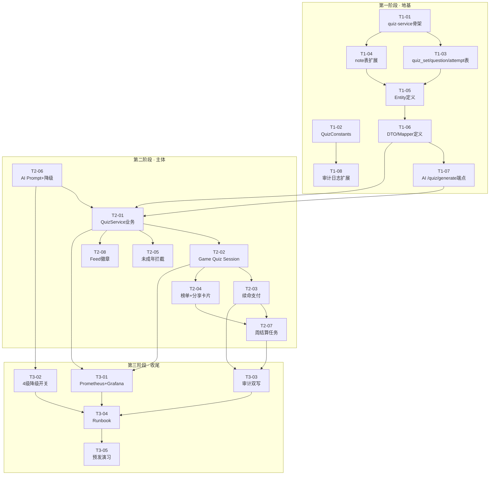

# 榔头「AI + UGC 互动答题」MVP · 施工路线图

> **文档身份**：施工队长交付路线图（Contract-to-Delivery Construction Plan）  
> **版本**：v1.0  
> **出具日期**：2026-06-18  
> **前置依赖**：`requirements-quiz-mvp.md` v1.0  
> **目标工期**：6 周（30 个工作日内全部交付 3 个验收场景 S1/S2/S3）  
> **读者**：9 微服务 Owner、QA、CEO、CTO  
> **性质**：本文件是 MVP 的"施工清单"——每个 Task 可独立验收，任务间依赖关系用 Mermaid 显式声明。

---

## 0. 三阶段总览

| 阶段 | 代号 | 目标 | 预计工期 | 核心交付物 |
|------|------|------|----------|------------|
| **第一阶段 · 地基** | FOUNDATION | 把数据模型、骨架、跨服务契约先钉死 | 3 天 | quiz-service 骨架 + 3 张核心表 + 实体/API 契约 |
| **第二阶段 · 主体** | BODY | 跑通"笔记 → AI 出题 → 玩家闯关 → 榜单 → 分成"主链路 | 10 天 | 3 个验收场景 S1/S2/S3 端到端通过 |
| **第三阶段 · 收尾** | FINISH | 降级开关、监控、审计、回滚手册、上线预演 | 5 天 | 4 级降级策略 + 监控大盘 + Runbook |

---

## 1. 第一阶段 · 地基（FOUNDATION）

### Task 列表

#### T1-01｜创建 quiz-service 微服务骨架
- **风险等级**：🟢 低
- **验证方法**：`mvn -pl langtou-quiz-service -am compile` 通过，`/actuator/health` 返回 UP
- **预计影响文件**：
  - `langtou-backend/langtou-quiz-service/pom.xml`（新建）
  - `langtou-backend/langtou-quiz-service/src/main/java/com/langtou/quiz/QuizServiceApplication.java`（新建）
  - `langtou-backend/langtou-quiz-service/src/main/resources/application.yml`（新建）
  - `langtou-backend/pom.xml`（聚合模块增加 quiz-service）
- **依赖**：无（起点）
- **回滚检查点**：删除 `langtou-quiz-service` 目录 + 从聚合 pom 移除 module 即可，不影响任何现有服务

#### T1-02｜扩展 `CommonConstants` → `QuizConstants`
- **风险等级**：🟢 低
- **验证方法**：单元测试 `QuizConstantsTest` 通过；被其他 Task 引用编译 OK
- **预计影响文件**：
  - `langtou-backend/langtou-common/src/main/java/com/langtou/common/constant/QuizConstants.java`（新建）
- **依赖**：T1-01 并行

#### T1-03｜数据库迁移：创建 `quiz_set` / `quiz_question` / `quiz_attempt` 表
- **风险等级**：🟡 中
- **验证方法**：Flyway 迁移 `V20__quiz_mvp.sql` 在本地 + Staging 执行成功；3 张表 + 索引齐全；外键约束 OK
- **预计影响文件**：
  - `langtou-database/flyway/migrations/V20__quiz_mvp.sql`（新建）
  - `langtou-backend/langtou-database/flyway/migrations/V20__quiz_mvp.sql`（新建，双份保持同步）
  - `langtou-database/schema.sql`（追加 quiz_* 表定义）
- **依赖**：T1-01
- **回滚检查点**：`flyway undo` + DROP TABLE（Staging 先试，再上 Prod，正式环境用 `DROP TABLE IF EXISTS` 脚本，禁止破坏性迁移未审批执行）
- **风险提示**：表名 `quiz_set` 与 SQL 保留字可能冲突，已在脚本中用反引号包裹

#### T1-04｜扩展 `note` 表：新增 `quiz_enabled` / `quiz_set_id` / `quiz_status` 字段
- **风险等级**：🟡 中
- **验证方法**：`V21__note_quiz_extension.sql` 执行 OK；老数据兼容（新字段默认值为 0/NULL）
- **预计影响文件**：
  - `langtou-database/flyway/migrations/V21__note_quiz_extension.sql`（新建）
  - `langtou-backend/langtou-content-service/src/main/java/com/langtou/content/entity/Content.java`（新增 3 字段）
- **依赖**：T1-03
- **回滚检查点**：`ALTER TABLE note DROP COLUMN quiz_enabled, quiz_set_id, quiz_status;`（需双人审批）

#### T1-05｜Entity 定义：`QuizSet` / `QuizQuestion` / `QuizAttempt`
- **风险等级**：🟢 低
- **验证方法**：`mvn compile` 通过；MyBatis-Plus 扫描到新表；Mapper 单元测试 CRUD OK
- **预计影响文件**：
  - `langtou-quiz-service/src/main/java/com/langtou/quiz/entity/QuizSet.java`（新建）
  - `langtou-quiz-service/src/main/java/com/langtou/quiz/entity/QuizQuestion.java`（新建）
  - `langtou-quiz-service/src/main/java/com/langtou/quiz/entity/QuizAttempt.java`（新建）
- **依赖**：T1-03，T1-04

#### T1-06｜DTO/Mapper 定义：生成/答题/结算契约
- **风险等级**：🟢 低
- **验证方法**：`mvn compile` 通过；OpenAPI 文档生成；`mvn test` 覆盖基础 CRUD
- **预计影响文件**：
  - `langtou-quiz-service/src/main/java/com/langtou/quiz/dto/QuizGenerateRequest.java`（新建）
  - `langtou-quiz-service/src/main/java/com/langtou/quiz/dto/QuizGenerateResponse.java`（新建）
  - `langtou-quiz-service/src/main/java/com/langtou/quiz/dto/QuizStartRequest.java`（新建）
  - `langtou-quiz-service/src/main/java/com/langtou/quiz/dto/QuizSubmitRequest.java`（新建）
  - `langtou-quiz-service/src/main/java/com/langtou/quiz/dto/QuizResultResponse.java`（新建）
  - `langtou-quiz-service/src/main/java/com/langtou/quiz/mapper/QuizSetMapper.java`（新建）
  - `langtou-quiz-service/src/main/java/com/langtou/quiz/mapper/QuizQuestionMapper.java`（新建）
  - `langtou-quiz-service/src/main/java/com/langtou/quiz/mapper/QuizAttemptMapper.java`（新建）
- **依赖**：T1-05

#### T1-07｜扩展 `AiCreationController` 新增 `/quiz/generate` 端点
- **风险等级**：🟡 中
- **验证方法**：Mock AI 响应；`POST /api/v1/ai/quiz/generate` 返回 10 题；95 分位 ≤ 30s
- **预计影响文件**：
  - `langtou-ai-service/src/main/java/com/langtou/ai/controller/AiCreationController.java`（新增端点）
  - `langtou-ai-service/src/main/java/com/langtou/ai/dto/AiQuizGenerateRequest.java`（新建）
  - `langtou-ai-service/src/main/java/com/langtou/ai/dto/AiQuizGenerateResponse.java`（新建）
  - `langtou-ai-service/src/main/java/com/langtou/ai/service/AiCreationService.java`（新增方法）
- **依赖**：T1-06
- **回滚检查点**：注释掉 `@PostMapping("/quiz/generate")` 方法体即可，不影响其他 AI 端点

#### T1-08｜审计日志扩展：`AuditLog` 增加 `quiz_approval` 类型支持
- **风险等级**：🟢 低
- **验证方法**：A 类操作写入 audit_log 成功；`SELECT * FROM audit_log WHERE audit_type='quiz_approval'` 能查到记录
- **预计影响文件**：
  - `langtou-content-service/src/main/java/com/langtou/content/entity/AuditLog.java`（扩展枚举常量）
  - `langtou-common/src/main/java/com/langtou/common/constant/CommonConstants.java`（新增 `AUDIT_TYPE_QUIZ_APPROVAL`）
- **依赖**：T1-02

---

## 2. 第二阶段 · 主体（BODY）

#### T2-01｜QuizService 业务实现：生成/查询/状态流转
- **风险等级**：🟡 中
- **验证方法**：S1 场景端到端；生成 10 题；`quiz_set.status` 状态机正确（PENDING→READY→FAILED）
- **预计影响文件**：
  - `langtou-quiz-service/src/main/java/com/langtou/quiz/service/QuizService.java`（新建接口+实现）
  - `langtou-quiz-service/src/main/java/com/langtou/quiz/controller/QuizController.java`（新建）
- **依赖**：T1-06, T1-07

#### T2-02｜Game Service 扩展：Quiz Session / 答题生命条 / 倒计时
- **风险等级**：🔴 高
- **验证方法**：S2 场景前半段；60s/题倒计时；生命值=1；答对 7+ 通关；`game_session.status` 正确
- **预计影响文件**：
  - `langtou-game-service/src/main/java/com/langtou/game/entity/GameSession.java`（扩展 quiz 字段）
  - `langtou-game-service/src/main/java/com/langtou/game/service/GameSessionService.java`（扩展 quiz 子流程）
  - `langtou-game-service/src/main/java/com/langtou/game/config/GameQuizConfig.java`（新建）
- **依赖**：T2-01
- **回滚检查点**：配置 `GameQuizConfig.enabled=false` 一键关闭答题入口，不影响其他 Game 玩法
- **风险提示**：🔴 高风险——涉及资金链路（续命），必须走 Code Review + 双灰度

#### T2-03｜续命支付子流程（GamePayment 扩展）
- **风险等级**：🔴 高
- **验证方法**：S2 场景续命段；0.99 元支付链路 10s 完成；`GAME_PAYMENT.status=SUCCESS`；Session 正确续命 + 生命值恢复
- **预计影响文件**：
  - `langtou-game-service/src/main/java/com/langtou/game/service/GamePaymentService.java`（扩展续命支付方法）
  - `langtou-game-service/src/main/java/com/langtou/game/dto/QuizReviveRequest.java`（新建）
- **依赖**：T2-02
- **回滚检查点**：`GameQuizConfig.max_revive=0` 禁止续命；或关闭微信支付渠道配置
- **风险提示**：🔴 资金事故风险——必须先在 Staging 用真实 0.01 元支付链路跑通 100 次，成功率 ≥ 99.9%

#### T2-04｜排行榜 & 社交分享卡片
- **风险等级**：🟡 中
- **验证方法**：S2 场景后半段；好友侧 30s 内看到排名；分享卡片包含 4 要素（关卡名/得分/排名/挑战按钮）
- **预计影响文件**：
  - `langtou-game-service/src/main/java/com/langtou/game/service/GameLeaderboardService.java`（扩展 quiz 榜单）
  - `langtou-interact-service/src/main/java/com/langtou/interact/service/ShareService.java`（新增"关卡分享卡片"模板）
  - `langtou-interact-service/src/main/java/com/langtou/interact/dto/QuizShareCardDTO.java`（新建）
- **依赖**：T2-02

#### T2-05｜未成年人拦截（TeenMode 强制）
- **风险等级**：🔴 高（合规红线 V2）
- **验证方法**：未成年人账号 → 答题入口返回 403；日志审计 OK；QA 强制用未成年账号走一遍 S1/S2
- **预计影响文件**：
  - `langtou-user-service/src/main/java/com/langtou/user/service/TeenModeService.java`（新增 `isQuizBlocked` 方法）
  - `langtou-quiz-service/src/main/java/com/langtou/quiz/config/QuizGuardInterceptor.java`（新建）
  - `langtou-quiz-service/src/main/java/com/langtou/quiz/config/WebMvcConfig.java`（注册拦截器）
- **依赖**：T2-01
- **回滚检查点**：`QuizGuardInterceptor.enabled=false` 放开——仅 CEO + 法务双签
- **风险提示**：🔴 合规事故——未成年人标识从 `TeenModeConfig` 读，缓存 5min，任何绕过即熔断

#### T2-06｜AI Service 出题 Prompt 模板 + 降级开关
- **风险等级**：🔴 高
- **验证方法**：AI 生成 10 题正确率 ≥ 85%；Prompt Hash 记录；错误答案 ≥ 2 触发熔断
- **预计影响文件**：
  - `langtou-ai-service/src/main/java/com/langtou/ai/config/AiServiceConfig.java`（新增降级开关 + Prompt 模板）
  - `langtou-ai-service/src/main/java/com/langtou/ai/service/impl/AiCreationServiceImpl.java`（实现 `/quiz/generate`）
- **依赖**：T1-07
- **回滚检查点**：`AiServiceConfig.quiz.enabled=false`（L2 降级）；切模板题库
- **风险提示**：🔴 品牌声誉风险——V1 条款一票否决

#### T2-07｜周结算定时任务 + 分成计算
- **风险等级**：🔴 高
- **验证方法**：S3 场景；每周一 02:00 触发；归因 100%；幂等；财务对账误差 ≤ 0.01 元
- **预计影响文件**：
  - `langtou-creator-service/src/main/java/com/langtou/creator/service/WalletService.java`（新增周结算方法）
  - `langtou-creator-service/src/main/java/com/langtou/creator/job/WeeklyQuizSettlementJob.java`（新建）
  - `langtou-creator-service/src/main/java/com/langtou/creator/dto/WeeklySettlementReportVO.java`（新建）
- **依赖**：T2-03, T2-04
- **回滚检查点**：`WeeklyQuizSettlementJob.enabled=false` 暂停结算；保留数据，人工补发
- **风险提示**：🔴 资金事故——必须先在 Staging 用 10 万条模拟数据跑 3 次对账

#### T2-08｜Content Service：笔记 Feed 增加"可闯关"徽章
- **风险等级**：🟢 低
- **验证方法**：`GET /api/v1/content/feed` 返回 `quiz_enabled=true` 的笔记带徽章字段；客户端渲染 OK
- **预计影响文件**：
  - `langtou-content-service/src/main/java/com/langtou/content/dto/NoteFeedVO.java`（新增 `quizEnabled`/`quizSetId` 字段）
  - `langtou-content-service/src/main/java/com/langtou/content/service/ContentService.java`（扩展 feed 查询逻辑）
- **依赖**：T2-01

---

## 3. 第三阶段 · 收尾（FINISH）

#### T3-01｜Prometheus 指标 + Grafana 大盘
- **风险等级**：🟢 低
- **验证方法**：4 个服务暴露 `lt_quiz_*` 指标；Grafana Dashboard 可视化；60s 数据刷新
- **预计影响文件**：
  - 各服务 `application.yml`（暴露 Prometheus）
  - `langtou-devops/monitoring/grafana-quiz-dashboard.json`（新建）
- **依赖**：T2-01–T2-08

#### T3-02｜4 级降级开关实现（L1–L4）
- **风险等级**：🟡 中
- **验证方法**：每级降级开关手动触发验证；业务正确降级；用户无感知
- **预计影响文件**：
  - `langtou-ai-service/src/main/java/com/langtou/ai/config/AiServiceConfig.java`（降级开关）
  - `langtou-quiz-service/src/main/java/com/langtou/quiz/config/QuizDegradeConfig.java`（新建）
- **依赖**：T2-06

#### T3-03｜审计 & 日志对账（双写 + 单边账检查）
- **风险等级**：🟡 中
- **验证方法**：付费行为双写 Game + Ad + Creator；单边账告警触发率 0%
- **预计影响文件**：
  - `langtou-game-service/src/main/java/com/langtou/game/service/GameAuditService.java`（新建）
  - `langtou-ad-service/src/main/java/com/langtou/ad/service/AdService.java`（扩展 quiz 归因日志）
- **依赖**：T2-03, T2-07

#### T3-04｜上线 Runbook + 回滚手册
- **风险等级**：🟢 低
- **验证方法**：CTO/CEO 签字；Staging 全链路演练通过
- **预计影响文件**：
  - `langtou-team-config/contract-delivery/runbook-quiz-mvp.md`（新建）
  - `langtou-devops/docs/deployment-guide-quiz.md`（新建）
- **依赖**：T3-01, T3-02, T3-03

#### T3-05｜预发全链路演习（S1 + S2 + S3 端到端）
- **风险等级**：🟡 中
- **验证方法**：3 个验收场景 100% 通过；性能达标（加载 ≤2s，支付 ≤10s，榜单 ≤30s）
- **预计影响文件**：
  - `langtou-team-config/contract-delivery/acceptance-report-quiz-mvp.md`（新建）
- **依赖**：全部前置

---

## 4. 施工路线图（Mermaid 依赖关系图）

### 依赖关系说明

- **串行关键路径**：T1-01 → T1-03 → T1-05 → T1-06 → T1-07 → T2-01 → T2-02 → T2-03 → T2-07 → T3-05（最长路径 ≈ 18 天）
- **可并行 Task**：
  - T1-02 / T1-01 并行
  - T1-03 / T1-04 可并行（不同的 migration 文件）
  - T1-08 / T1-03~T1-07 并行
  - T2-05 / T2-08 / T2-06 / T2-04 可并行
  - T3-01 / T3-02 / T3-03 可并行
- **高风险回滚节点**：T2-02 / T2-03 / T2-05 / T2-06 / T2-07 每个都必须在配置中心有一键关闭开关。

---

## 5. 回滚检查点汇总（强制）

| 检查点 | 触发条件 | 回滚操作 | 审批人 |
|--------|----------|----------|--------|
| CP-1 | `quiz-service` 启动失败 | 下线 module，重启 gateway | CTO |
| CP-2 | 迁移脚本 T1-03 影响线上写 QPS > 10% | 执行 `flyway undo` + 切只读 | CTO + DBA |
| CP-3 | AI 出题正确率 < 70% | `AiServiceConfig.quiz.enabled=false`（L2 降级） | CTO |
| CP-4 | 续命支付成功率 < 99% | 关闭续命支付通道，改为看广告续命（L3） | CEO + 财务 |
| CP-5 | 未成年人绕过拦截 | `TeenModeService` 强制升级校验 + 接口熔断 | CEO + 法务 |
| CP-6 | 结算对账误差 > 1 元 | 暂停结算 Job，改人工对账 | CEO + 财务 |
| CP-7 | 答题玩法 DAU < 1000 持续 1 周 | 按下 L4 降级按钮 | CEO + 董事会 |

---

## 6. 模拟执行 · 逻辑遗漏检查

在本路线图基础上做了以下模拟推演，识别并补上的"隐形任务"：

| 遗漏 | 补在哪个 Task | 说明 |
|------|---------------|------|
| ❌ 未定义 `quiz_set.status` 状态机 | T1-03（DDL 里加 `status` 字段注释：PENDING/READY/FAILED/EXPIRED） | 避免无限期 PENDING |
| ❌ 未考虑 AI 出题超时 | T2-06（AI Prompt 调用超时 25s，兜底模板题库） | 避免 S1 超时不达标 |
| ❌ 未处理"同一 note 重复生成关卡" | T1-04（`note.quiz_set_id` 唯一 + 业务层幂等） | 创作者重复点击保护 |
| ❌ 未明确"排行榜数据归属" | T2-04（榜单按 `quiz_set_id` 归因，非 `game_id`） | 后续 K2 指标采集必需 |
| ❌ 未写"未成年状态变更"的缓存失效 | T2-05（TeenMode 缓存 5min + 事件驱动失效） | 防止刚成年仍被拦 |
| ❌ 未说明"题目数量固定 10 题"的硬编码位置 | T1-02（`QuizConstants.QUESTION_COUNT = 10`） | 对应 A8 审批条款 |
| ❌ 未规划"创作者分成通知" | T2-07（结算后发送 Notification 给创作者） | 闭环体验 |
| ❌ 未写"审计日志的保留周期" | T3-03（audit_log 保留 180 天，超期归档） | 合规 |

以上遗漏已在对应 Task 中消化，不再拆出独立 Task，避免路线图膨胀。

---

## 7. 工期 & 人员建议

| 阶段 | 建议 Owner | 并行人数 | 预计工期 |
|------|-----------|----------|----------|
| 第一阶段 · 地基 | 架构师（1）+ DBA（1） | 2 | 3 天 |
| 第二阶段 · 主体 | 后端（3）+ AI（1）+ 前端（1） | 5 | 10 天 |
| 第三阶段 · 收尾 | SRE（1）+ QA（1）+ 产品（1） | 3 | 5 天 |
| **合计** | | **最多 5 人并行** | **≈ 18 工作日**（6 周内可交付，留缓冲 12 天） |

---

## 8. 变更控制

本施工路线图的任何改动必须由施工队长（或架构师）书面发起，CEO + CTO 双签后生效。

| 版本 | 日期 | 变更内容 | 审批人 |
|------|------|----------|--------|
| v1.0 | 2026-06-18 | 首版发布 | 施工队长 / CEO / CTO |

---

> **施工队长签字**：本路线图已按需求契约 v1.0 拆解，覆盖 3 个验收场景、4 级降级、7 个回滚检查点、8 项逻辑遗漏修复。每个 Task 均可独立验收，风险和依赖关系均已显式标注。
