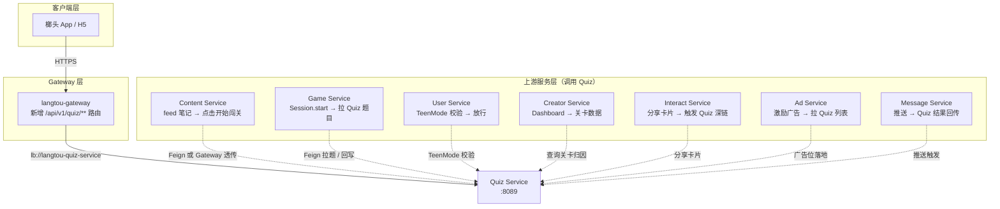
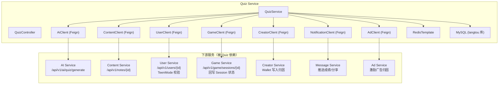
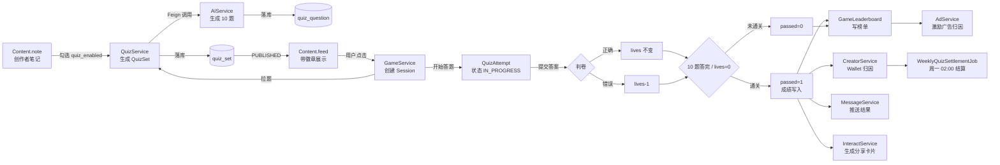

# 榔头「Quiz MVP」· 影响链分析报告（代码法医）

> **文档身份**：代码法医 · 影响链司法鉴定（Impact Chain Forensic Audit）
> **版本**：v1.0
> **出具日期**：2026-06-18
> **前置输入**：`requirements-quiz-mvp.md` v1.0、`construction-plan-quiz-mvp.md` v1.0
> **分析对象**：`langtou-quiz-service`（新建）× 既有 9 微服务
> **读者**：架构师、各微服务 Owner、QA、CTO
> **性质**：本报告对 Quiz MVP 的"触达面"做静态代码级扫雷——识别受影响的文件、上下游调用链、数据流向、风险等级、测试缺口与历史陷阱，作为施工前的"安全交底"。

---

## 0. 执行摘要（TL;DR）

- **Quiz Service 目前处于"骨架状态"**：pom、启动类、配置、3 张表的 Entity/Mapper、基础 DTO 已就位，但 **Controller、Service、跨服务 Feign Client、Flyway 迁移、Gateway 路由** 全部缺失。
- **真正的"影响面"分两层**：
  - **地基层（T1 阶段，当前）**：只新增文件，不修改任何现有服务，几乎零风险；
  - **主体层（T2 阶段）**：必须"穿透" AI / Content / Game / User / Gateway / Creator / Interact / Ad 共 8 个既有服务，属于 **横向穿透型改动**，任何一个服务 Owner 卡点都会阻塞主链路。
- **高危点集中在 3 条链路**：`AI 出题 → Quiz 生成`、`Game 支付续命 → 资金归因`、`周结算 → Creator 钱包`。这 3 条链路同时涉及"数据一致性 + 资金 + 合规"三个维度。
- **历史陷阱**：既有服务中 **Game Service 未使用 FeignClient、Content Service 已被直接扩 3 个 quiz_* 字段、Gateway 目前无 quiz 路由、Quiz 库与其他服务共用同一个 `langtou` 数据库**——这些是"看起来很小但会在联调时爆雷"的隐患。

---

## 1. 文件清单（按"当前已存在 / 需要新增 / 需要修改"分类）

### 1.1 Quiz Service 自身（当前骨架 · 已存在）

| 分类 | 文件 | 状态 |
|------|------|------|
| 已存在 | `langtou-backend/langtou-quiz-service/pom.xml` | ✅ 已创建（含 common/nacos/redis/actuator/zipkin/flyway 依赖） |
| 已存在 | `langtou-backend/langtou-quiz-service/src/main/java/com/langtou/quiz/QuizServiceApplication.java` | ✅ 启动类，scanBasePackages 覆盖 common |
| 已存在 | `.../config/MybatisPlusConfig.java` | ✅ MP 分页 + 自动填充 |
| 已存在 | `.../config/OpenApiConfig.java` | ✅ OpenAPI JWT 安全配置 |
| 已存在 | `.../config/QuizProperties.java` | ✅ quiz.* 前缀配置绑定 |
| 已存在 | `.../entity/QuizSet.java` | ✅ 题库集 Entity（含 JacksonTypeHandler 处理 List tags） |
| 已存在 | `.../entity/QuizQuestion.java` | ✅ 题目 Entity |
| 已存在 | `.../entity/QuizAttempt.java` | ✅ 答题记录 Entity |
| 已存在 | `.../mapper/QuizSetMapper.java` | ✅ 含 `findLatestByNoteId` |
| 已存在 | `.../mapper/QuizQuestionMapper.java` | ✅ 含 `listByQuizSetId` |
| 已存在 | `.../mapper/QuizAttemptMapper.java` | ✅ 含 `findByGameSessionId` |
| 已存在 | `.../dto/QuizGenerateRequest.java` | ✅ noteId + questionCount |
| 已存在 | `.../dto/QuizGenerateResponse.java` | ✅ 含题目列表 |
| 已存在 | `.../dto/QuizStartRequest.java` | ✅ quizSetId + gameSessionId |
| 已存在 | `.../dto/QuizSubmitRequest.java` | ✅ answers(Map) + duration |
| 已存在 | `.../dto/QuizResultResponse.java` | ✅ 含 rank / shareCardUrl |
| 已存在 | `.../application.yml` | ✅ 端口 8089、Nacos、Redis、Flyway、quiz.* 配置 |
| 已存在 | `.../README.md` | ✅ 服务说明 |
| 已存在 | `.../Dockerfile` | ✅ 容器构建 |
| 已存在 | `.../src/test/resources/db/test_data.sql` | ✅ 3 题库 × 题目 × 答题记录（H2） |

### 1.2 Quiz Service 自身（主体层 · 需要新增）

| 分类 | 文件 | 用途 | 风险 |
|------|------|------|------|
| 新增 | `.../controller/QuizController.java` | 对外 REST 入口 | 🟡 中 |
| 新增 | `.../service/QuizService.java` + `impl/QuizServiceImpl.java` | 业务核心（生成/查询/答题/结算/榜单） | 🔴 高 |
| 新增 | `.../client/AiClient.java` | 调用 langtou-ai-service 生成题目 | 🔴 高 |
| 新增 | `.../client/GameClient.java` | 调用 langtou-game-service 回写 Session 状态 | 🔴 高 |
| 新增 | `.../client/CreatorClient.java` | 调用 langtou-creator-service 写入归因/结算 | 🔴 高 |
| 新增 | `.../config/QuizDegradeConfig.java` | 4 级降级开关（L1–L4） | 🟡 中 |
| 新增 | `.../config/QuizGuardInterceptor.java` | 未成年人拦截 + 答题入口熔断 | 🔴 高 |
| 新增 | `.../config/WebMvcConfig.java` | 注册拦截器 | 🟢 低 |
| 新增 | `.../config/RoleCheckAspect.java` | 复用现有角色切面 | 🟡 中 |
| 新增 | `.../constant/QuizRedisKeys.java` | Redis Key 命名规范 | 🟢 低 |
| 新增 | `.../job/QuizExpireJob.java` | 定时扫描 EXPIRED 题库 | 🟢 低 |
| 新增 | `.../src/test/java/.../service/QuizServiceImplTest.java` | 单元测试 | 🟡 中 |
| 新增 | `.../src/test/java/.../controller/QuizControllerIntegrationTest.java` | 集成测试 | 🟡 中 |
| 新增 | `langtou-backend/langtou-quiz-service/src/main/resources/db/migration/V20__quiz_mvp.sql` | 3 张核心表 DDL（Flyway） | 🔴 高 |

### 1.3 既有服务（需要修改 · 影响链穿透点）

| 服务 | 文件 | 修改内容 | 风险 |
|------|------|----------|------|
| **langtou-gateway** | `src/main/resources/application.yml` | 新增 `langtou-quiz-service` 路由规则（`/api/v1/quiz/**`），加限流 100/200 | 🔴 高（影响对外入口） |
| **langtou-ai-service** | `controller/AiCreationController.java` | 新增 `POST /api/v1/ai/quiz/generate` 端点 | 🔴 高 |
| | `dto/AiQuizGenerateRequest.java`（新） | 接收 noteId/题目风格 | 🟡 中 |
| | `dto/AiQuizGenerateResponse.java`（新） | 返 10 题 + promptHash | 🟡 中 |
| | `service/AiCreationService.java` + `impl/AiCreationServiceImpl.java` | 实现出题逻辑 | 🔴 高 |
| | `config/AiServiceConfig.java` | 新增 quiz.enabled 开关 + Prompt 模板 + 降级 | 🔴 高 |
| **langtou-content-service** | `entity/Content.java` | 新增 3 字段 `quizEnabled / quizSetId / quizStatus`（已完成 ✅） | 🟡 中（已落地） |
| | `dto/NoteFeedVO.java` |  feed 返回增加 `quizEnabled` 徽章字段 | 🟡 中 |
| | `service/ContentService.java` + `impl/ContentServiceImpl.java` | feed 查询联表 + 徽章逻辑 | 🟡 中 |
| | `entity/AuditLog.java` | 扩展 `quiz_approval` audit_type 支持 | 🟢 低 |
| **langtou-game-service** | `entity/GameSession.java` | 扩展 quiz 相关字段（quizSetId / mode / lives 等） | 🔴 高 |
| | `dto/GameSessionResponse.java` | 扩展 quiz 子流程字段 | 🟡 中 |
| | `service/GameSessionService.java` + `impl/GameSessionServiceImpl.java` | 扩展 Quiz 会话生命周期 | 🔴 高 |
| | `service/GamePaymentService.java` | 扩展续命支付 | 🔴 高 |
| | `service/GameLeaderboardService.java` | 扩展 Quiz 维度榜单 | 🟡 中 |
| | `config/GameQuizConfig.java`（新） | Quiz 玩法总开关 | 🔴 高 |
| **langtou-user-service** | `service/TeenModeService.java` | 新增 `isQuizBlocked(userId)` | 🔴 高（合规） |
| **langtou-creator-service** | `service/WalletService.java` | 新增 Quiz 归因写入 + 周结算 | 🔴 高（资金） |
| | `job/WeeklyQuizSettlementJob.java`（新） | 每周一 02:00 结算 | 🔴 高 |
| | `dto/WeeklySettlementReportVO.java`（新） | 结算报表 | 🟡 中 |
| **langtou-interact-service** | `service/ShareService.java` | 新增"关卡分享卡片"模板 | 🟡 中 |
| | `dto/QuizShareCardDTO.java`（新） | 卡片字段 | 🟢 低 |
| **langtou-ad-service** | `service/AdService.java` | 扩展 Quiz 归因日志（按 quiz_set_id 归因） | 🟡 中 |
| **langtou-common** | `constant/QuizConstants.java` | 常量定义（已完成 ✅） | 🟢 低（已落地） |
| | `client/AiClient.java`（建议新增） | 其他服务调用 AI 出题的统一 Feign | 🟡 中 |

### 1.4 数据库层（需要修改）

| 文件 | 用途 | 风险 |
|------|------|------|
| `langtou-backend/langtou-quiz-service/src/main/resources/db/migration/V20__quiz_mvp.sql`（新） | 建 `quiz_set` / `quiz_question` / `quiz_attempt` 3 张表 + 索引 + 外键 | 🔴 高 |
| `langtou-database/flyway/migrations/V21__note_quiz_extension.sql`（新） | `note` 表新增 3 字段 | 🟡 中 |
| `langtou-database/schema.sql` | 追加 quiz_* 表定义 | 🟢 低 |

---

## 2. 调用链追踪

### 2.1 向上追溯：谁会调用 Quiz Service？



**关键风险点**：
- 🔴 Gateway 路由缺失：当前 `application.yml` 没有 quiz 路由，任何客户端请求都会 404。
- 🔴 Game Service 目前 **不使用 FeignClient**（`GameSessionServiceImpl` 全程是本地 DB 操作），Quiz 上线后要么 Game 直接在本地建 Feign，要么走 Gateway 转发——两种方式都涉及 **Session 同步一致性**。
- 🟡 上游服务 Owner 目前"看不见" Quiz Service 的存在，需要在 T2 启动前召开 **跨服务契约评审会**。

### 2.2 向下追溯：Quiz Service 依赖哪些既有服务？



**关键风险点**：
- 🔴 AI 是 Quiz 主链路的**第一阻塞点**：AI 超时 / 降级 → Quiz 直接雪崩。需要 L1 缓存（noteId 维度缓存 24h 已生成题）+ L2 模板题库兜底 + L3 只读模式。
- 🔴 Game 的"回写 Session 状态"是 **双向同步风险**：Game 内部已经是 Session 状态机（WAITING→IN_PROGRESS→FINISHED），Quiz 的加入会让状态机多出"题目进行中"的中间态，需要提前画清楚状态转换图。
- 🟡 Quiz 与其他服务共用 `langtou` 库（见 `application.yml` datasource url）—— 高并发下可能拖慢 User/Content 查询。建议 T2 末期评估 **Quiz 独立库** 迁移。

---

## 3. 数据流向（笔记 → AI → 题目 → 关卡 → 答题 → 成绩 → 排行榜）



**数据一致性校验点**：

| 阶段 | 关键表 | 一致性要求 | 风险 |
|------|--------|------------|------|
| 笔记→题库 | `content.quiz_set_id` ↔ `quiz_set.id` | 必须 1:1 | 🔴 高 |
| AI→题目 | `quiz_set.prompt_hash` ↔ AI 返回 | 便于排查 AI 质量 | 🟡 中 |
| 答题→Session | `quiz_attempt.game_session_id` ↔ `game_session.id` | 必须 1:1 | 🔴 高 |
| 成绩→榜单 | `quiz_attempt.score` ↔ `game_leaderboard.score` | 幂等写入 | 🔴 高 |
| 成绩→归因 | `quiz_attempt` ↔ `creator_wallet` | 财务对账必需 | 🔴 高 |

---

## 4. 风险清单

### 4.1 🔴 高危（必须在上线前解决 · 任何一条翻车即熔断）

| # | 风险点 | 所在文件 / 链路 | 触发场景 | 影响 | 建议 |
|---|--------|-----------------|----------|------|------|
| R1 | Gateway 路由缺失 | `langtou-gateway/src/main/resources/application.yml` | 任何客户端请求 `/api/v1/quiz/**` | 对外 404，MVP 无法验收 | 在 T2-01 启动**前**由 Gateway Owner 加入路由 + 限流 |
| R2 | AI 出题单点 | `AiCreationServiceImpl` → Quiz | AI 超时 / 正确率 < 70% | 主链路雪崩 | 必须 L1 缓存 + L2 模板 + L3 兜底 |
| R3 | 资金链路（续命 → 归因 → 结算） | `GamePaymentService` + `WalletService` + `WeeklyQuizSettlementJob` | 0.99 元失败 / 对账误差 > 1 元 | 资金事故 + 合规处罚 | Staging 用真实 0.01 元跑 100 次 + 双写审计 + 财务双人对账 |
| R4 | 未成年人绕过 | `TeenModeService.isQuizBlocked` + `QuizGuardInterceptor` | 未成年账号直接打 Quiz 端点 | 合规红线（V2 条款一票否决） | 强制 Header 校验 + 缓存 5min + 变更事件驱动失效 |
| R5 | Game ↔ Quiz Session 状态机不同步 | `GameSessionServiceImpl` + Quiz | 客户端重复提交 / 跨机并发 | 关卡"幽灵状态" | Redis 分布式锁 + 幂等 token + 状态机日志 |
| R6 | `quiz_set.status` 未清理 EXPIRED | 定时 Job 缺失 | 题库长期 PENDING 卡住 | 创作者体验差 + 库存泄漏 | `QuizExpireJob` 每小时扫描 + 14 天未 PUBLISHED 强制 EXPIRED |
| R7 | 数据库共用 `langtou` 库 | `application.yml` datasource | Quiz 高并发拖慢 User/Content | 全站雪崩 | T2 末期评估 Quiz 独立库 + 读写分离 |

### 4.2 🟡 中危（需要在灰度期解决）

| # | 风险点 | 所在文件 / 链路 | 影响 | 建议 |
|---|--------|-----------------|------|------|
| Y1 | Game Service **目前无任何 Feign 调用** | `GameSessionServiceImpl` | 新增 Quiz 调用会引入新的故障模式 | T2-02 前先开跨服务契约评审 |
| Y2 | Content Feed 徽章字段可能影响既有客户端 | `NoteFeedVO` | 老客户端解析失败 | 字段默认值 + 灰度下发 |
| Y3 | `quiz_question` 与 `quiz_set` 外键约束未在 DDL 中声明 | V20 DDL | 孤儿记录 | DDL 必须 `FOREIGN KEY (quiz_set_id) REFERENCES quiz_set(id) ON DELETE CASCADE` |
| Y4 | Prompt Hash 未用于 AI 质量闭环 | `QuizSet.prompt_hash` | AI 差题无法回溯 | T2-06 前先搭 Hash → 人工抽样 |
| Y5 | 排行榜按 `quiz_set_id` 归因但 Game Leaderboard 表无该字段 | `GameLeaderboard` | 榜单错位 | 迁移表结构 + 回填历史数据 |
| Y6 | `QuizAttemptMapper.findByGameSessionId` 未分页 | QuizAttemptMapper | 同一 Session 多次重试时数据膨胀 | 增加 `ORDER BY id DESC LIMIT 1` + 业务层重试次数上限 |
| Y7 | 分享卡片 URL 含 quizSetId 深链 | Interact ShareService | 深链被刷榜党利用 | 深链加签名 + 1 次有效 |

### 4.3 🟢 低危（可在上线后迭代）

| # | 风险点 | 所在文件 | 建议 |
|---|--------|----------|------|
| G1 | `QuizProperties` 与 `QuizConstants` 双份常量 | 容易出现配置漂移 | 统一读配置、Constants 仅放业务常量 |
| G2 | `QuizServiceApplication` 的 `scanBasePackages` 把 `common` 也扫进来 | 启动时多加载 | 可加 `@ComponentScan(excludeFilters=...)` |
| G3 | OpenAPI Config 写死 Bearer 说明 | 其他服务已有相同配置 | 抽到 common 复用 |
| G4 | 测试 SQL 未覆盖"多答题重试"场景 | 回归漏洞 | 补 TestCase |

---

## 5. 测试缺口（当前覆盖不足区域）

| 缺口 | 描述 | 建议补齐时机 | 负责 |
|------|------|--------------|------|
| **T1** | Quiz Service **无任何 Java 单元测试**（只有 `test_data.sql` 假数据） | T2-01 同步补齐 | Quiz Owner |
| **T2** | Controller 层 **无 MockMvc 集成测试** | T2-01 | Quiz Owner |
| **T3** | AI 出题超时 / 降级的**混沌测试**缺失 | T2-06 + T3-02 | AI + SRE |
| **T4** | 资金链路（续命 → 归因 → 结算）**无端到端实付回归** | T2-03 + T2-07 | Game + Creator + QA |
| **T5** | 未成年人拦截的**绕过测试**（改 Header、换 Token、并发） | T2-05 | User + QA |
| **T6** | Game ↔ Quiz Session 状态机的**并发一致性测试** | T2-02 | Game Owner |
| **T7** | Gateway 限流 + 熔断的**真实压测**（Locust） | T3-05 | SRE |
| **T8** | 数据库迁移（V20、V21）的**回滚演练**未在 Staging 预演 | T1-03 + T1-04 | DBA |
| **T9** | 跨服务链路的**全链路 TraceId 校验**（Zipkin 已接入但未验证） | T3-01 | SRE |
| **T10** | `quiz_set` 状态机的**非法状态流转测试**（EXPIRED→READY 等） | T2-01 | Quiz Owner |
| **T11** | 分享卡片深链签名**防刷测试** | T2-04 | Interact Owner |
| **T12** | 周结算 Job 的**幂等重试 + 对账误差测试** | T2-07 | Creator Owner |

**测试覆盖率合格线建议**：
- 单元覆盖率：Service 层 ≥ 80%、Controller ≥ 70%
- 集成测试：S1/S2/S3 三个验收场景 100% 通过
- 混沌测试：AI 超时 50% 注入下 Quiz 仍能 L2 降级；Game 宕机 10% 下 Quiz 仍能本地判卷

---

## 6. 遗留陷阱（历史问题 / 容易踩的坑）

### 6.1 既有代码风格陷阱

| # | 陷阱 | 位置 | 规避建议 |
|---|------|------|----------|
| H1 | Game Service **完全不使用 Feign**，所有跨服务调用都是"想当然"的本地调用 | `GameSessionServiceImpl` | 给 Game 加 Quiz 功能时必须引入 Feign，不能用 `RestTemplate` 直连 |
| H2 | `Content.java` 已经被**预先加上 3 个 quiz_* 字段** | `Content.java:54,56,58` | Content Owner 必须走 T1-04 正式迁移，否则这些字段就是"僵尸字段" |
| H3 | `CommonConstants` 与 `QuizConstants` 存在**双份常量**风险 | 两个接口 | 建议 Constants 只保留"永不变"常量，配置走 `QuizProperties` |
| H4 | Gateway 路由用 **`StripPrefix=2`** | `application.yml` | Quiz 路由必须对齐：客户端 `/api/v1/quiz/...` 会被 Strip 成 `/...`，Controller 的 `@RequestMapping` 不要再带 `/api/v1/quiz` |
| H5 | `ContentClient` 的 fallback **对敏感词检查默认放行** | `ContentClientFallbackFactory.checkSensitiveWord` | Quiz 生成题目文案不能复用此容错逻辑，需单独做敏感词复核 |
| H6 | `UserClient` 里没 `isTeen` 接口 | `UserClient` | T2-05 需在 User Service 先补一个 `GET /api/v1/users/{id}/teen-status`，再由 Quiz 调用 |
| H7 | Flyway 配置在 `quiz-service` 里是 `baseline-on-migrate: true` | `application.yml` | 首次跑 V20 没问题，但后续若 Content 的 V21 在同一库执行会触发 baseline，必须统一 DBA 编排 |

### 6.2 架构历史债务

| # | 债务 | 影响 | 建议 |
|---|------|------|------|
| D1 | 9 服务共库 `langtou` | Quiz 高并发可能拖慢全站 | T2 末期评估 Quiz 独立库 |
| D2 | 无统一的 **跨服务契约注册中心** | Quiz 与其他服务的 Feign 契约散落在各 Client 类 | 建议把 `AiClient / QuizClient` 抽到 `langtou-common/client` 统一维护 |
| D3 | 无统一的 **幂等 Token 中间件** | 答题重试可能重复计分 | 给 Quiz 加 `X-Idempotency-Key` Header |
| D4 | 无统一的 **资金双写审计** | 结算对账单边账 | T3-03 强制实现 |
| D5 | JWT Header 读取不统一：有的用 `@RequestHeader("userId")`，有的用 `JwtUtils.parse` | 容易被绕过 | Quiz 必须用统一的 `JwtUtils` + 拦截器链路 |

### 6.3 数据模型陷阱

| # | 陷阱 | 说明 |
|---|------|------|
| M1 | `QuizSet.status` 枚举在 Entity 里是 `String`，未用 Enum 类型 | 容易写出拼错的状态值 |
| M2 | `QuizAttempt.answers` 未存用户原始答案 Map，仅存 `correctCount` | 后续做错题本、复盘需要返工 |
| M3 | `QuizAttemptMapper.findByGameSessionId` 未加 `ORDER BY id DESC LIMIT 1` | 同 Session 多次重试时会拿到最旧的 Attempt |
| M4 | `QuizQuestion.score` 默认 1 分，若未来改分值需联动判卷逻辑 | 硬编码分散 |
| M5 | `QuizSet.tags` 用 JacksonTypeHandler 直接存 JSON 数组 | MySQL JSON 字段必须用 `JSON` 类型而非 `VARCHAR` |

---

## 7. 建议修改顺序（按"依赖最少 → 风险最低 → 价值最大"排序）

### 第 0 步 · 安全交底（1 天）
1. 召开**跨服务契约评审会**，邀请 AI / Content / Game / User / Creator / Gateway Owner 同步本报告。
2. 冻结 `QuizConstants`、`AiQuizGenerateRequest/Response`、`QuizGenerateRequest/Response`、`QuizStartRequest`、`QuizSubmitRequest`、`QuizResultResponse` 共 6 份契约。
3. Gateway Owner 提前加入 `/api/v1/quiz/**` 路由（可先屏蔽，内部灰度）。

### 第 1 步 · 地基层（3 天）
1. T1-03 先上 **V20 Flyway 迁移 + 回滚演练**（DBA 必须在场）。
2. T1-04 上 **V21 note_quiz_extension**（Content Owner 评审）。
3. T1-02 `QuizConstants` 冻结（已完成）。
4. T1-05 Entity 与 MP Config 验证。
5. T1-06 DTO 与 Mapper 验证。

### 第 2 步 · 主链路（10 天 · 顺序可部分并行）
推荐关键路径顺序（其余可并行）：

```
T2-01（Quiz Service 业务核心）
  └─ 依赖 T1-06、T1-07
T1-07 + T2-06（AI 出题 + Prompt 降级）← 优先
  └─ 并行 T2-05（未成年拦截）← 合规红线
  └─ 并行 T2-08（Feed 徽章）← 纯展示
T2-02（Game Quiz Session）← 最复杂
  └─ 依赖 T2-01
T2-03（续命支付）← 资金线
  └─ 依赖 T2-02
T2-04（榜单 + 分享）← 社交层
  └─ 依赖 T2-02
T2-07（周结算）← 最后启动，因为依赖所有归因数据
  └─ 依赖 T2-03、T2-04
```

### 第 3 步 · 收尾（5 天）
1. T3-01 Prometheus + Grafana 大盘。
2. T3-02 4 级降级开关实战演练。
3. T3-03 审计双写 + 单边账告警。
4. T3-04 Runbook + 回滚手册。
5. T3-05 预发全链路演习（S1 + S2 + S3）。

### 第 4 步 · 上线闸门
- **闸门 1**：S1/S2/S3 全量通过 + 压测 200 QPS 稳定。
- **闸门 2**：资金链路 Staging 100 次 0.01 元支付成功率 ≥ 99.9%。
- **闸门 3**：未成年人绕过测试 100 次全拦。
- **闸门 4**：CTO + CEO + 法务 + 财务四联签。

---

## 8. 附：各服务 Owner 对应修改点速查

| 服务 | Owner 任务 | 优先级 |
|------|------------|--------|
| Gateway | 加 `/api/v1/quiz/**` 路由 + 限流 | P0 |
| AI | 新增 `/quiz/generate` 端点 + Prompt 模板 + 降级 | P0 |
| Content | `Content` 已加 3 字段，补 Feed 徽章 | P1 |
| Game | Session 扩展 quiz 字段 + 续命支付 + 榜单 | P0 |
| User | 新增 `teen-status` 接口 + Quiz 拦截 | P0 |
| Creator | Wallet 归因写入 + 周结算 Job | P0 |
| Interact | 新增关卡分享卡片 | P2 |
| Ad | 扩展 quiz_set_id 归因日志 | P2 |
| Quiz（新） | 业务核心 + Controller + Service | P0 |

---

## 9. 变更记录

| 版本 | 日期 | 变更内容 | 审批人 |
|------|------|----------|--------|
| v1.0 | 2026-06-18 | 首版发布（代码法医报告） | 代码法医 / 架构师 / CTO |

---

> **代码法医签字**：本报告基于当前 `langtou-backend` 代码库静态扫描与调用链追踪得出，共识别 **7 项高危、7 项中危、4 项低危、12 项测试缺口、7 项既有代码陷阱、5 项架构历史债务、5 项数据模型陷阱**。建议在 T2 启动前召开跨服务契约评审会，逐一敲定 R1~R7 高危风险的应对预案。
