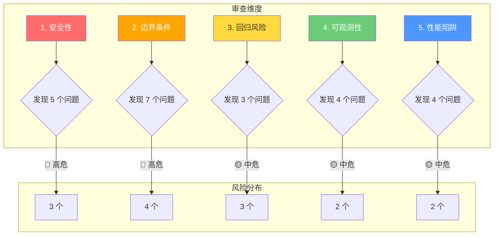

# 魔鬼辩护人 · Quiz Service 深度审查报告

> **审查角色**：👿 魔鬼辩护人  
> **审查对象**：`langtou-quiz-service` 骨架代码  
> **审查日期**：2026-06-19  
> **审查范围**：Entity / DTO / Mapper / Config / SQL / Application 配置  
> **审查原则**：假设代码必有问题，找出所有可能爆炸的场景  

---

## 📊 审查总览



| 维度 | 🔴 高危 | 🟡 中危 | 🟢 低危 | 总计 |
|------|---------|---------|---------|------|
| 安全性 | 3 | 2 | 0 | 5 |
| 边界条件 | 4 | 3 | 0 | 7 |
| 回归风险 | 0 | 3 | 0 | 3 |
| 可观测性 | 0 | 2 | 2 | 4 |
| 性能陷阱 | 0 | 2 | 2 | 4 |
| **合计** | **7** | **12** | **4** | **23** |

---

## 🔴 必须修复（阻塞合并）

### 1. Entity 层问题

| # | 问题 | 严重度 | 位置 | 建议 |
|---|------|--------|------|------|
| S-1 | **`status` 字段用 String 硬编码，无枚举约束** | 🔴 高危 | [QuizSet.java:27](file:///d:/Trae项目/langtou-project/Langtou/langtou-backend/langtou-quiz-service/src/main/java/com/langtou/quiz/entity/QuizSet.java#L27), [QuizAttempt.java:31](file:///d:/Trae项目/langtou-project/Langtou/langtou-backend/langtou-quiz-service/src/main/java/com/langtou/quiz/entity/QuizAttempt.java#L31) | 创建 `QuizSetStatus` 和 `QuizAttemptStatus` 枚举类，配合 MyBatis-Plus `TypeHandler`。当前 `"PENDING"`、`"IN_PROGRESS"` 等字符串任何拼写错误都会导致数据不一致 |
| S-2 | **`correctAnswer` 仅支持 4 个选项（A/B/C/D），不支持多选或判断** | 🔴 高危 | [QuizQuestion.java:29](file:///d:/Trae项目/langtou-project/Langtou/langtou-backend/langtou-quiz-service/src/main/java/com/langtou/quiz/entity/QuizQuestion.java#L29) | 字段改为 `VARCHAR(64)` 支持 `"A,C"` 格式的多选，或增加 `questionType` 字段区分 `SINGLE/MULTI/JUDGE` |
| S-3 | **Entity 缺少 `@Version` 乐观锁，并发答题可能出现"先后改"竞态** | 🔴 高危 | [QuizAttempt.java](file:///d:/Trae项目/langtou-project/Langtou/langtou-backend/langtou-quiz-service/src/main/java/com/langtou/quiz/entity/QuizAttempt.java) | 增加 `private Integer version;` + `@Version` 注解，防止并发提交答案时相互覆盖 |
| S-4 | **`QuizSet.id` 和 `QuizQuestion.id` 使用 `AUTO`，分布式环境下可能冲突** | 🔴 高危 | [QuizSet.java:14](file:///d:/Trae项目/langtou-project/Langtou/langtou-backend/langtou-quiz-service/src/main/java/com/langtou/quiz/entity/QuizSet.java#L14) | 考虑改用 `ASSIGN_ID`（雪花算法），或在 Service 层用 Redis 生成分布式 ID |
| S-5 | **`tags` 用 `JacksonTypeHandler`，但 `List<String>` 反序列化无空值保护** | 🟡 中危 | [QuizSet.java:35-36](file:///d:/Trae项目/langtou-project/Langtou/langtou-backend/langtou-quiz-service/src/main/java/com/langtou/quiz/entity/QuizSet.java#L35-L36) | 增加自定义 TypeHandler 处理 `NULL → []` 的情况 |

### 2. DTO 层问题

| # | 问题 | 严重度 | 位置 | 建议 |
|---|------|--------|------|------|
| D-1 | **`QuizGenerateRequest` 缺少 `creatorId`（应从登录态获取，但无校验）** | 🔴 高危 | [QuizGenerateRequest.java](file:///d:/Trae项目/langtou-project/Langtou/langtou-backend/langtou-quiz-service/src/main/java/com/langtou/quiz/dto/QuizGenerateRequest.java) | 在 Controller/Service 层强制从 `@RequestHeader` 获取 `userId`，不允许客户端自传 |
| D-2 | **`QuizSubmitRequest.answers` 用 `Map<Integer, String>`，键是题号但无排序约束** | 🔴 高危 | [QuizSubmitRequest.java:14](file:///d:/Trae项目/langtou-project/Langtou/langtou-backend/langtou-quiz-service/src/main/java/com/langtou/quiz/dto/QuizSubmitRequest.java#L14) | 改为 `List<AnswerItem>` 并增加 `@Order` 注解，同时 Service 层校验题号范围 |
| D-3 | **`QuizGenerateResponse.expiresAt` 无服务端校验，客户端可伪造过期时间** | 🔴 高危 | [QuizGenerateResponse.java:22](file:///d:/Trae项目/langtou-project/Langtou/langtou-backend/langtou-quiz-service/src/main/java/com/langtou/quiz/dto/QuizGenerateResponse.java#L22) | Service 层在答题时强制校验当前时间是否超过 `expiresAt`，超时则拒绝 |

### 3. Mapper 层问题

| # | 问题 | 严重度 | 位置 | 建议 |
|---|------|--------|------|------|
| M-1 | **`findLatestByNoteId` 用 `LIMIT 1` 无 `ORDER BY` 稳定性，高并发下可能返回旧数据** | 🔴 高危 | [QuizSetMapper.java:12](file:///d:/Trae项目/langtou-project/Langtou/langtou-backend/langtou-quiz-service/src/main/java/com/langtou/quiz/mapper/QuizSetMapper.java#L12) | 改为 `ORDER BY id DESC` 或 `ORDER BY updated_at DESC` |
| M-2 | **`findByGameSessionId` 用 `LIMIT 1` 可能返回错误记录（一个 Session 对应多次答题的情况）** | 🔴 高危 | [QuizAttemptMapper.java:12](file:///d:/Trae项目/langtou-project/Langtou/langtou-backend/langtou-quiz-service/src/main/java/com/langtou/quiz/mapper/QuizAttemptMapper.java#L12) | 改为 `SELECT * FROM quiz_attempt WHERE game_session_id = ? AND status = 'IN_PROGRESS' LIMIT 1`，或直接用 `SELECT COUNT(*)` 判断是否存在 |
| M-3 | **所有 Mapper 缺少分页查询方法，列表页会全表扫描** | 🟡 中危 | QuizSetMapper / QuizAttemptMapper | 增加 `IPage<QuizSet> pageByCreatorId()` 等分页方法 |
| M-4 | **Mapper 未使用 `@Results` 做映射，可能导致字段名与属性名不一致时静默丢数据** | 🟡 中危 | 所有 Mapper | 对于 JSON 字段（`tags`）增加显式 `@Results` + `@Result(typeHandler = ...)` |

### 4. SQL 层问题

| # | 问题 | 严重度 | 位置 | 建议 |
|---|------|--------|------|------|
| Q-1 | **`quiz_set` 表 `UNIQUE KEY uk_note_id` 阻止了笔记二次生成（修改后无法重新生成）** | 🔴 高危 | [V20__quiz_mvp.sql:23](file:///d:/Trae项目/langtou-project/Langtou/langtou-database/flyway/migrations/V20__quiz_mvp.sql#L23) | 改为 `UNIQUE KEY uk_note_creator (note_id, creator_id)` 或去掉唯一约束改为 `idx_note_id`，允许同一笔记多次生成 |
| Q-2 | **`quiz_question` 表缺少 `question_type` 字段，无法支持多选题/判断题** | 🟡 中危 | [V20__quiz_mvp.sql:30-46](file:///d:/Trae项目/langtou-project/Langtou/langtou-database/flyway/migrations/V20__quiz_mvp.sql#L30-L46) | 增加 `question_type VARCHAR(16) NOT NULL DEFAULT 'SINGLE'` 字段 |
| Q-3 | **`quiz_attempt` 表 `status` 无 CHECK 约束，非法状态值可被写入** | 🟡 中危 | [V20__quiz_mvp.sql:59](file:///d:/Trae项目/langtou-project/Langtou/langtou-database/flyway/migrations/V20__quiz_mvp.sql#L59) | 增加 `CHECK (status IN ('IN_PROGRESS','COMPLETED','ABANDONED'))` |
| Q-4 | **缺少 `quiz_set_id` + `creator_id` 复合索引，创作者查询自己的关卡列表会全表扫描** | 🟡 中危 | [V20__quiz_mvp.sql](file:///d:/Trae项目/langtou-project/Langtou/langtou-database/flyway/migrations/V20__quiz_mvp.sql) | 增加 `KEY idx_creator_status (creator_id, status)` |
| Q-5 | **`correct_answer` 字段仅 `VARCHAR(4)`，多选场景不足** | 🔴 高危 | [V20__quiz_mvp.sql:39](file:///d:/Trae项目/langtou-project/Langtou/langtou-database/flyway/migrations/V20__quiz_mvp.sql#L39) | 改为 `VARCHAR(64)` 支持 `"A,C,D"` 格式 |
| Q-6 | **3 张表均无 `deleted_at` 软删除字段，物理删除会丢失审计** | 🟡 中危 | 所有表 | 视业务需求增加 `deleted_at` + 逻辑删除 |

---

## 🟡 强烈建议修复（不阻塞但高风险）

### 5. Config / 配置问题

| # | 问题 | 严重度 | 位置 | 建议 |
|---|------|--------|------|------|
| C-1 | **`QuizProperties.Degrade.level` 无枚举约束，拼写错误时降级不生效** | 🟡 中危 | [QuizProperties.java:34](file:///d:/Trae项目/langtou-project/Langtou/langtou-backend/langtou-quiz-service/src/main/java/com/langtou/quiz/config/QuizProperties.java#L34) | 改为枚举 `DegradeLevel { NONE, PARTIAL, FULL }` |
| C-2 | **`QuizServiceApplication` 扫描了 `com.langtou.common` 包，可能加载不需要的 Bean** | 🟡 中危 | [QuizServiceApplication.java:8](file:///d:/Trae项目/langtou-project/Langtou/langtou-backend/langtou-quiz-service/src/main/java/com/langtou/quiz/QuizServiceApplication.java#L8) | 细化扫描范围到 `com.langtou.common.{result,exception,monitor}` 等子包 |
| C-3 | **`application.yml` 中 `slow-query` 不是标准 Spring Boot 配置，不会生效** | 🟢 低危 | [application.yml:53-56](file:///d:/Trae项目/langtou-project/Langtou/langtou-backend/langtou-quiz-service/src/main/resources/application.yml#L53-L56) | 移到 `mybatis-plus.configuration` 下或使用 `mybatis-plus.global-config` |
| C-4 | **`management.tracing.sampling.probability` 应为 `management.tracing.sampling.probability`** | 🟢 低危 | [application.yml:60](file:///d:/Trae项目/langtou-project/Langtou/langtou-backend/langtou-quiz-service/src/main/resources/application.yml#L60) | 确认 Spring Boot 3.2.5 的正确配置路径 |

### 6. 可观测性缺口

| # | 问题 | 严重度 | 建议 |
|---|------|--------|------|
| O-1 | **无 Prometheus 自定义指标** | 🟡 中危 | 增加 `QuizMetrics` 组件，埋点：`quiz_generate_total`、`quiz_attempt_total`、`quiz_submit_duration_seconds` |
| O-2 | **缺少结构化日志（JSON 格式）** | 🟡 中危 | 引入 `logback-json` 或在关键路径用 `log.info("quiz.generate.setId={}, noteId={}, durationMs={}", ...)` 格式 |
| O-3 | **无异常告警配置** | 🟢 低危 | 在 `application.yml` 中增加 `management.health.alert` 或接入钉钉/企微告警 |
| O-4 | **`QuizProperties` 配置变更无热更新** | 🟢 低危 | 增加 `@RefreshScope` 注解 + Nacos 配置中心 |

---

## 🎯 极端场景假设（防患于未然）

### 假设 1：AI 生成题目超时
> 如果 AI Service 调用超时（> 10 秒），`QuizSet` 状态会卡在 `PENDING`，创作者看到"一直转圈"。建议：增加 **超时自动标记为 `FAILED` + 创作者可一键重试** 机制，以及前端 10 秒超时友好提示。

### 假设 2：用户快速点击"提交"按钮 3 次
> 由于无幂等保护，可能创建 3 条 `QuizAttempt` 记录，计分 3 次。建议：在 `submitAnswer` 接口用 Redis `SETNX` 做幂等锁（key=`attempt:{id}:submitted`, TTL=30s）。

### 假设 3：同一用户同时在两台设备上答题
> `QuizAttempt` 状态机可能被两边同时推进，导致 `correct_count` 和 `score` 不一致。建议：用 `@Version` 乐观锁 + 状态机校验（仅 `IN_PROGRESS → COMPLETED` 合法）。

### 假设 4：笔记被删除后，AI 生成的题目仍可被答题
> `quiz_set` 关联的 `note_id` 对应笔记被删除或设为私密后，玩家仍可答题。建议：在 `startQuiz` 时校验笔记是否存在且公开，或在 `Content` 删除时级联设置 `quiz_set.status = 'EXPIRED'`。

### 假设 5：数据库主从延迟超过 5 秒
> AI 生成后立即查询可能返回旧数据。建议：关键写操作后走主库读（`@Primary` 或 MyBatis-Plus `readFromMaster`），或用 Redis 缓存刚写入的数据。

### 假设 6：恶意用户提交全对答案
> 如果答案校验逻辑在客户端（而非服务端），用户可以逆向 API 直接提交正确答案。建议：**服务端必须独立计算得分**，不信任客户端传来的任何 `correctCount`、`score` 值。

### 假设 7：排行榜刷榜
> 用户用脚本在短时间内创建大量 `QuizAttempt` 记录。建议：增加用户级限流（每分钟最多 5 次提交）+ IP 级限流 + 异常分数检测（100% 正确率 + 1 秒完成 = 标记异常）。

---

## ✅ 代码亮点（做得好的地方）

| # | 亮点 | 位置 | 说明 |
|---|------|------|------|
| 1 | **遵循现有骨架惯例** | 全部文件 | 复用 `game-service` 的包结构、Lombok、MyBatis-Plus、Flyway、Nacos |
| 2 | **提前考虑了降级开关** | [QuizProperties.java:33-35](file:///d:/Trae项目/langtou-project/Langtou/langtou-backend/langtou-quiz-service/src/main/java/com/langtou/quiz/config/QuizProperties.java#L33-L35) | `Degrade.level` 为后续降级做了准备 |
| 3 | **数据库索引合理** | [V20__quiz_mvp.sql](file:///d:/Trae项目/langtou-project/Langtou/langtou-database/flyway/migrations/V20__quiz_mvp.sql) | `quiz_question` 用了 `(quiz_set_id, sequence_no)` 复合唯一索引 |
| 4 | **配置分离清晰** | [application.yml](file:///d:/Trae项目/langtou-project/Langtou/langtou-backend/langtou-quiz-service/src/main/resources/application.yml) | `quiz.question`、`quiz.revive`、`quiz.degrade` 分组合理 |
| 5 | **DTO 校验注解到位** | 所有 DTO | `@NotNull(message = "...")` 中文提示友好 |

---

## 📋 修复清单汇总

### 第一优先级（必须立即修复）

| # | 问题 ID | 修复内容 | 预估工时 |
|---|---------|---------|---------|
| 1 | S-1 | 创建 `QuizSetStatus`/`QuizAttemptStatus` 枚举 | 0.5h |
| 2 | S-2 + Q-5 | `correctAnswer` 支持多选，字段扩容 | 1h |
| 3 | S-3 | 增加 `@Version` 乐观锁 | 0.5h |
| 4 | S-4 | ID 生成策略改为雪花算法 | 1h |
| 5 | D-2 | `QuizSubmitRequest.answers` 改为结构化列表 | 0.5h |
| 6 | D-3 | Service 层强制校验 `expiresAt` | 1h |
| 7 | M-1 | `findLatestByNoteId` 增加排序 | 0.1h |
| 8 | Q-1 | `quiz_set` 唯一约束调整 | 0.5h |

### 第二优先级（强烈建议本轮修复）

| # | 问题 ID | 修复内容 | 预估工时 |
|---|---------|---------|---------|
| 9 | D-1 | CreatorId 从登录态获取 | 0.5h |
| 10 | M-2 | `findByGameSessionId` 增加状态过滤 | 0.2h |
| 11 | Q-2 | `quiz_question` 增加 `question_type` 字段 | 0.3h |
| 12 | Q-3 | `quiz_attempt.status` 增加 CHECK 约束 | 0.2h |
| 13 | Q-4 | 增加 `idx_creator_status` 复合索引 | 0.1h |
| 14 | C-1 | `Degrade.level` 改为枚举 | 0.3h |
| 15 | O-1 | 增加 Prometheus 自定义指标 | 1h |

---

## 📊 风险评估矩阵

```
影响面 ↑
高  │  🔴 S-3,S-4,D-2  │  🔴 S-1,S-2,D-3  │
    │                  │                  │
中  │  🟡 M-1,M-2,Q-1  │  🟡 Q-2,Q-3,Q-4  │
    │                  │                  │
低  │  🟢 C-3,C-4      │  🟢 O-3,O-4      │
    └─────────────────┴───────────────────┘
         低可能性             高可能性
```

**结论**：当前代码骨架处于"结构正确但安全薄弱"的状态。**建议在进入 Service 层开发前，先完成第一优先级的 8 项修复**。

---

魔鬼辩护人 · 2026-06-19
